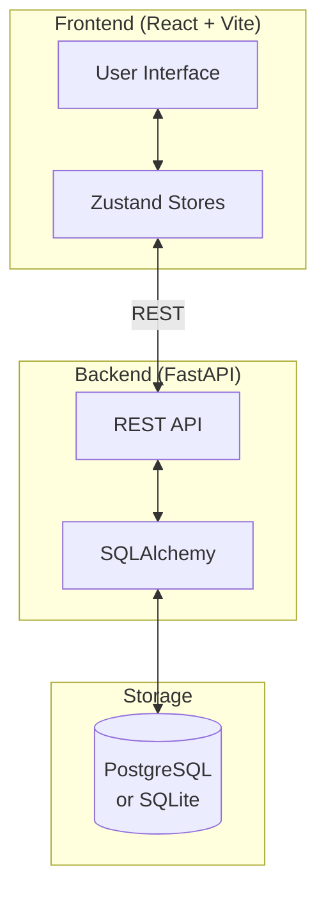

# Open-Q

**Open-Q** is an open-source platform for conducting **Q-methodology** research. It provides a seamless, modern interface for participants to perform Q-sorts and for researchers to collect and analyze subjective viewpoints.

[](https://www.gnu.org/licenses/agpl-3.0)

---

## 📚 Documentation

| Audience           | Guide                                                                                                                                           |
| ------------------ | ----------------------------------------------------------------------------------------------------------------------------------------------- |
| 🔬 **Researchers** | [Q-Methodology Guide](docs/researchers/q-methodology.md) · [Study Configuration](docs/CONFIG_REFERENCE.md) · [Data Export](docs/DATA_EXPORT.md) |
| 👩‍💻 **Developers**  | [Architecture](docs/ARCHITECTURE.md) · [API Reference](docs/developers/api-reference.md) · [Testing](docs/developers/testing.md)                |
| 🚀 **Deployment**  | [Production Deployment](docs/getting-started/deployment.md)                                                                                     |

---

## ✨ Features

- **Modern Q-Sort Interface** — Drag-and-drop with fluid animations
- **Multi-language Support** — Fully internationalized (i18n) for global research
- **Responsive Design** — Desktop, tablet, and mobile optimized
- **Flexible Configuration** — Define grid shapes, pre-sort fields, and post-sort questions via JSON
- **Real-time Progress** — Auto-saves participant progress

---

## 🏗️ Architecture



---

## 🔄 Study Flow

Participants progress through 5 stages in a Q-methodology study:


| Stage          | Purpose                                         |
| -------------- | ----------------------------------------------- |
| **Welcome**    | Study instructions, consent agreement           |
| **Pre-Sort**   | Demographics and context questions              |
| **Rough Sort** | Initial categorization (Agree/Neutral/Disagree) |
| **Fine Sort**  | Precise placement in Q-grid pyramid             |
| **Post-Sort**  | Qualitative explanations of extreme choices     |

---

## 🚀 Quick Start

### Prerequisites

- **Node.js** 18+
- **Python** 3.10+
- **Make** (optional)

### Local Development

```bash
# Clone repository
git clone https://github.com/jvastenaekels/open-q.git
cd open-q

# Backend
cd backend
python -m venv venv && source venv/bin/activate
pip install -r requirements.txt
python init_db.py && python seed.py
uvicorn app.main:app --reload

# Frontend (new terminal)
cd frontend
npm install
npm run dev
```

**Or use Make:**

```bash
make run-backend  # Terminal 1
make run-frontend # Terminal 2
```

Visit: **http://localhost:5173/study/example-study/welcome**

---

## 🧪 Testing

```bash
# Frontend unit tests
cd frontend && npm test

# Frontend E2E tests (Chromium, Firefox, WebKit)
cd frontend && npm run e2e

# Backend tests
cd backend && pytest
```

---

## 📁 Project Structure

```
open-q/
├── frontend/           # React + Vite + TypeScript
│   ├── src/
│   │   ├── pages/      # Route components
│   │   ├── components/ # Reusable UI (GridSort, CardStack)
│   │   ├── hooks/      # Custom hooks (useGridZoom, useFineSortDrag)
│   │   ├── store/      # Zustand stores
│   │   └── locales/    # i18n translations
│   └── e2e/            # Playwright E2E tests
├── backend/            # FastAPI + SQLAlchemy
│   ├── app/
│   │   ├── main.py     # API entry point
│   │   ├── models.py   # SQLAlchemy models
│   │   └── routers/    # API endpoints
│   └── studies/        # JSON study configurations
└── docs/               # Documentation
```

---

## 📄 License

This project is licensed under the **GNU Affero General Public License v3.0** — see the [LICENSE](LICENSE) file for details.

---

## 🤝 Contributing

Contributions are welcome! Please read our [Contributing Guidelines](docs/CONTRIBUTING.md) before submitting a PR.
