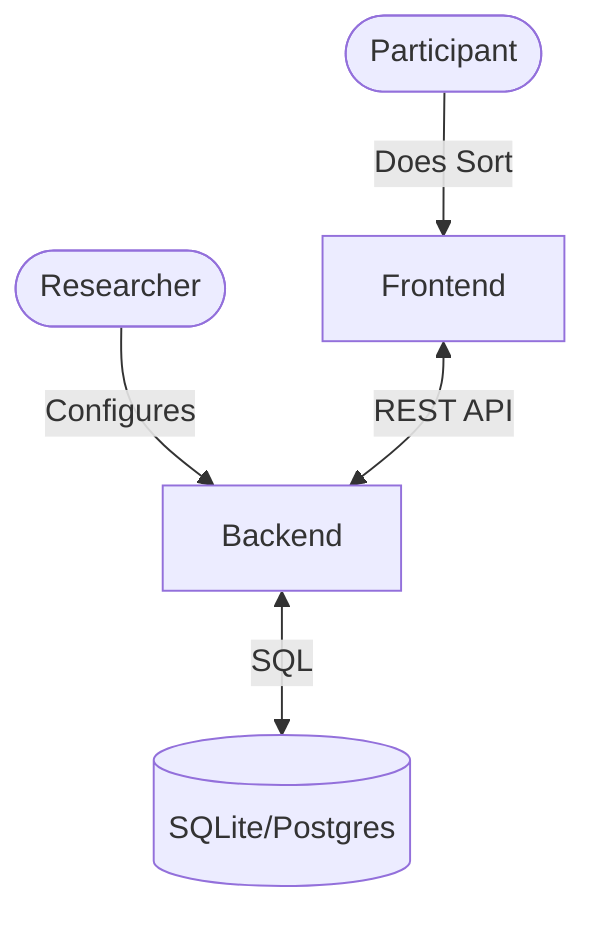

# Open-Q

Open-Q is an open-source platform for conducting **Q-methodology** research. It provides a seamless, modern interface for participants to perform q-sorts and for researchers to collect and analyze qualitative data.

---

## 🚀 Quick Links

- 📘 [Documentation Roadmap](docs/documentation_roadmap.md)
- 🏗️ [Architecture Overview](docs/ARCHITECTURE.md)
- 🧪 [Researcher Guide](docs/README_STRUCTURE.md#docsresearchersmd-how-to-use-open-q-for-research) (Coming Soon)
- 👩‍💻 [Developer Guide](docs/README_STRUCTURE.md#docsdevelopersmd-local-setup--contribution-guide)

---

## ✨ Key Features

- **Modern Q-Sort Interface**: Drag-and-drop powered by `dnd-kit` with fluid animations via `Framer Motion`.
- **Multi-language Support**: Fully internationalized (i18n) for global research.
- **Responsive Design**: Works on Desktop and Mobile (Tablet recommended for sorting).
- **FastAPI Backend**: High-performance asynchronous API.
- **Flexible Configuration**: Define grid shapes, pre-sort fields, and post-sort questions via JSON.

---

## 🏗️ System Overview



---

## 🛠️ Getting Started

### Prerequisites

- **Node.js** (v18+)
- **Python** (3.10+)
- **Make** (Optional, for easy automation)

### Fast Local Setup

1. **Clone the repository**:

   ```bash
   git clone https://github.com/jvastenaekels/open-q.git
   cd open-q
   ```

2. **Run Backend**:

   ```bash
   cd backend
   python -m venv venv
   source venv/bin/activate # or venv\Scripts\activate on Windows
   pip install -r requirements.txt
   python init_db.py # Initialize database
   python seed.py    # Seed with example data
   uvicorn app.main:app --reload
   ```

3. **Run Frontend**:
   ```bash
   cd frontend
   npm install
   npm run dev
   ```

_Or use the provided `Makefile` in the root:_

- `make run-backend`
- `make run-frontend`

---

## 📄 License

This project is licensed under the GNU Affero General Public License v3.0 - see the [LICENSE](LICENSE) file for details.
