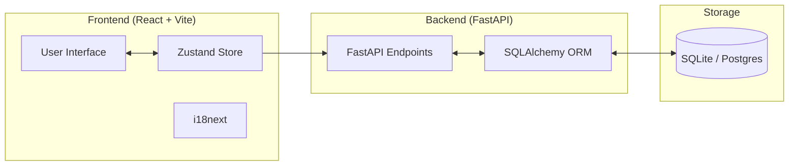

# Open-Q Architecture

This document describes the technical architecture, design choices, and data flow of the Open-Q platform.

## 🏗️ High-Level Perspective

Open-Q follows a decoupled Client-Server architecture.

## 💻 Tech Stack Rationale

### Frontend

- **React + Vite**: Chosen for fast development cycle (HMR) and modern ecosystem.
- **TypeScript**: Ensuring type safety across the application, especially for complex Q-sort logic.
- **Zustand**: Selected for state management due to its simplicity and minimal boilerplate compared to Redux, while still providing robust global state.
- **Tailwind CSS**: For rapid UI development with a consistent design system.
- **dnd-kit**: A modern, accessible drag-and-drop library specifically designed for React.
- **Framer Motion**: For smooth, high-performance animations and transitions.

### Backend

- **FastAPI**: High performance, easy-to-use asynchronous framework with native OpenAPI support.
- **SQLAlchemy (Async)**: Industry-standard ORM for Python, utilizing async drivers for better concurrency.
- **Pydantic**: For strict data validation and serialization.

---

## 📊 Core Data Models

| Model                | Purpose                                                        | Key Relationships                                |
| :------------------- | :------------------------------------------------------------- | :----------------------------------------------- |
| **Study**            | Defines the Q-methodology experiment parameters.               | Has many Translations, Statements, Participants. |
| **StudyTranslation** | Localized content for a specific study.                        | Belongs to Study.                                |
| **Statement**        | The individual items being sorted.                             | Belongs to Study.                                |
| **Participant**      | A single session of a user taking the study.                   | Belongs to Study, Has many QSortEntries.         |
| **QSortEntry**       | A specific statement's placement in the grid by a participant. | Belongs to Participant & Statement.              |

---

## 🔄 Data Lifecycle

1. **Initialization**: Frontend fetches Study configuration and translations from the Backend.
2. **Session**: A `Participant` record is created. Progress is stored locally in Zustand and periodically synced (or synced at the end).
3. **Execution**:
   - **Pre-sort**: Metadata/Demographics.
   - **Rough Sort**: Initial categorization.
   - **Fine Sort**: Placement in the Q-grid.
   - **Post-sort**: Qualitative follow-up.
4. **Completion**: Final submission creates `QSortEntry` records and updates `Participant` status to `completed`.
