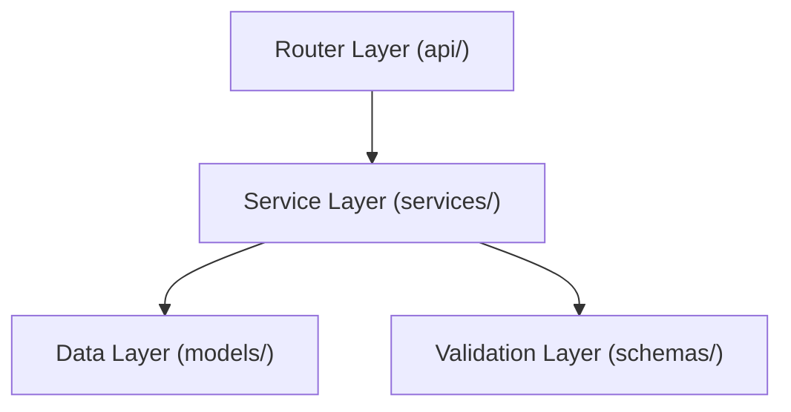

# Backend Architectural Guidelines

This document outlines the architectural patterns and best practices for the Qualis backend (FastAPI), ensuring consistency, maintainability, and scalability.

## 1. High-Level Architecture

Qualis follows a strict **Three-Tier Architecture** (also known as Controller-Service-Repository, though we treat Models as the data layer).



### 1.1 The Layers

1.  **Router Layer (`app/routers/`)**:
    *   **Responsibility**: Handle HTTP Request/Response mechanics, parsing parameters, and status codes.
    *   **Rule**: **NO Business Logic**. Routers should only call Services.
    *   **Output**: Returns Pydantic Schemas (`response_model`).

2.  **Service Layer (`app/services/`)**:
    *   **Responsibility**: Business logic, domain rules, validation beyond structure, and orchestration.
    *   **Rule**: Services accept Pydantic Schemas or primitives, and interact with SQLAlchemy Models. They should catch DB errors and raise application-specific exceptions if needed (or let global handlers catch them).
    *   **Dependency Injection**: Services are typically injected into Routers via `Depends()`.

3.  **Data Layer (`app/models/`)**:
    *   **Responsibility**: Database schema definitions (SQLAlchemy), grouped by subdomain (`user`, `project`, `study`, `participant`, `recruitment`, `concourse`, `analysis`).
    *   **Rule**: Rich models are encouraged (helper methods), but complex business rules belong in Services.

4.  **Validation Layer (`app/schemas/`)**:
    *   **Responsibility**: Data validation and strict typing (Pydantic), grouped by subdomain alongside the models.
    *   **Rule**: All I/O must be typed. No `dict` or `Any` passing between layers unless strictly necessary.

## 2. Directory Structure

```text
backend/app/
├── core/           # Config, security, exceptions
├── middleware/     # Global middleware (CORS, error handling)
├── routers/        # HTTP endpoints (admin/, auth.py, etc.)
├── schemas/        # Pydantic models, one module per subdomain
├── models/         # SQLAlchemy models, one module per subdomain
├── services/       # Business logic (study_service.py, etc.)
├── types/          # Shared TypedDict wire shapes
├── utils/          # Pure helpers (security, audit, crypto, email…)
└── main.py         # App entrypoint
```

The `models/__init__.py` and `schemas/__init__.py` re-export every public name, so `from app.models import Study` continues to work alongside `from app.models.study import Study`.

## 3. Strict typing

Most modules in `app/` are under `mypy --strict` via `[[tool.mypy.overrides]]` in `backend/pyproject.toml`. New utility/leaf modules should opt into the same bar by adding themselves to the overrides list. See the "Strict-typed Python modules" section in [`CLAUDE.md`](../../CLAUDE.md) for the canonical list and the conventions for using `# type: ignore[explicit-any]` at JSON boundaries.

## 3.1 JWT families and claim isolation

Qualis uses three JWT families, all signed with `SECRET_KEY` but isolated by a strict `purpose` claim:

| Family | `purpose` claim | Usage |
| ------ | --------------- | ----- |
| **Access** | `access` | Standard bearer token issued at login; carries `sub` (user id) and role. |
| **Invitation** | `invitation` | Single-use project-invitation link; carries `email` + `project_id`. |
| **Email-flow** | `email-verification` / `password-reset` / `2fa-disable` | Time-limited tokens for auth email flows; each carries a `jti` that is consumed once. |

`app.utils.security.decode_token(token, expected_purpose=...)` enforces the purpose check before returning claims. Passing a token from one family to an endpoint that expects another raises `InvalidTokenError`, so a stolen password-reset link cannot be replayed as an access token even though both are signed with the same key. The 2FA-disable JTI is additionally stored in the `consumed_email_tokens` table to prevent replay of the same link twice.

## 4. Best Practices

### 4.1 Async/Sync

*   **FastAPI & IO**: We use `async def` for routers.
*   **SQLAlchemy**: We use **async** SQLAlchemy (`AsyncSession`) for all database interactions. Use `await` for all DB calls.

### 4.2 Error Handling

Do not use generic `try/except` blocks in routers. Let exceptions propagate.
*   **Use `HTTPException`** for expected user errors (400, 404).
*   **Global Handler**: `middleware/errors.py` automatically catches generic exceptions and formats 500 errors.

### 4.3 Dependency Injection

Use `Depends()` for:
*   Authentication (`get_current_user`)
*   Database sessions (`get_db`)

## 5. Testing

*   **Integration tests**: We prioritise integration tests in `tests/integration/` that hit real endpoints with a real database.
*   **Fixture-driven**: Use `conftest.py` extensively for setup/teardown of DB state.
