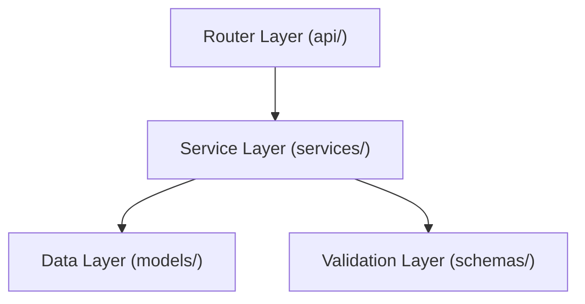

# Backend Architectural Guidelines

This document describes the architectural patterns and conventions for the Qualis backend (FastAPI).

## 1. High-Level Architecture

Qualis follows a strict **Three-Tier Architecture** (also known as Controller-Service-Repository, though we treat Models as the data layer).



### 1.1 The Layers

1.  **Router Layer (`app/routers/`)**:
    *   **Responsibility**: Handle HTTP Request/Response mechanics, parsing parameters, and status codes.
    *   **Rule**: **NO Business Logic**. Routers should only call Services.
    *   **Output**: Returns Pydantic Schemas (`response_model`).

2.  **Service Layer (`app/services/`)**:
    *   **Responsibility**: Business logic, domain rules, validation beyond structure, and orchestration.
    *   **Rule**: Services accept Pydantic Schemas or primitives, and interact with SQLAlchemy Models. They should catch DB errors and raise application-specific exceptions if needed (or let global handlers catch them).
    *   **Dependency Injection**: Services are stateless classes of `@staticmethod` async methods; routers call them directly (e.g. `StudyService.create_study(db, ...)`). `Depends()` is reserved for `get_db`, `get_current_user`, and the project/study role-guard factories — not services.

3.  **Data Layer (`app/models/`)**:
    *   **Responsibility**: Database schema definitions (SQLAlchemy), grouped by subdomain (`user`, `project`, `study`, `participant`, `recruitment`, `concourse`, `analysis`).
    *   **Rule**: Rich models are encouraged (helper methods), but complex business rules belong in Services.

4.  **Validation Layer (`app/schemas/`)**:
    *   **Responsibility**: Data validation and strict typing (Pydantic), grouped by subdomain alongside the models.
    *   **Rule**: All I/O must be typed. No `dict` or `Any` passing between layers unless strictly necessary.

## 2. Directory Structure

```text
backend/app/
├── core/           # Config (config.py); security lives in utils/, exceptions in app/exceptions.py
├── middleware/     # Global middleware (error handling, security headers, SPA, log scrubbing)
├── routers/        # HTTP endpoints (admin/, auth.py, etc.)
├── schemas/        # Pydantic models, one module per subdomain
├── models/         # SQLAlchemy models, one module per subdomain
├── services/       # Business logic (study_service.py, etc.)
├── types/          # Shared TypedDict wire shapes
├── utils/          # Pure helpers (security, audit, crypto, email…)
└── main.py         # App entrypoint
```

The `models/__init__.py` and `schemas/__init__.py` re-export every public name, so `from app.models import Study` continues to work alongside `from app.models.study import Study`.

## 3. Strict typing

Most modules in `app/` are under `mypy --strict` via `[[tool.mypy.overrides]]` in `backend/pyproject.toml`. New utility/leaf modules should opt into the same bar by adding themselves to the overrides list. See the "Strict-typed Python modules" section in [`CLAUDE.md`](../../CLAUDE.md) for the canonical list and the conventions for using `# type: ignore[explicit-any]` at JSON boundaries.

## 3.1 JWT families and claim isolation

Qualis uses three JWT families, all signed with `SECRET_KEY`. They are distinguished by **different mechanisms** — there is no single shared `purpose` claim: the access family carries no discriminator, the invitation family uses a `type` claim, and only the email-flow family uses a `purpose` claim.

| Family | Discriminator | Usage |
| ------ | ------------- | ----- |
| **Access** | (none) | Standard bearer token issued at login; carries `sub` (the user's email) plus `iat`/`exp`. No role claim — authorization is resolved server-side from the User and ProjectMember records. |
| **Invitation** | `type` = `invitation` | Project- or study-scoped invitation link (7-day expiry); carries the invitee email in `sub`, `role`, and optionally `project_id` or `study_id`. Not single-use — there is no jti/denylist; the link is replayable until it expires. |
| **Email-flow** | `purpose` = `email_verify` / `password_reset` / `twofa_disable` / `email_change_confirm` / `email_change_cancel` | Time-limited tokens for auth email flows; every token carries a `jti`, but single-use enforcement varies by purpose (see below). |

`decode_email_token(token, expected_purpose=...)` enforces the purpose check (raising `ValueError` on mismatch). Access and invitation tokens use separate decoders — `decode_access_token` (no discriminator) and `decode_invitation_token` (checks the `type` claim, raising `jwt.InvalidTokenError`).

Cross-family misuse is rejected, but the error type differs: invitation-token misuse raises `jwt.InvalidTokenError`, email-flow purpose mismatch raises `ValueError`. The access decoder does no purpose check — email-flow tokens are kept out of it via the `aud`/`iss` claims that `decode_email_token` validates, not via the access path.

Single-use enforcement on email-flow tokens varies by purpose: only `twofa_disable` records its jti in the `consumed_email_tokens` table. `password_reset` instead uses the `pwa` (`password_changed_at`) claim as replay defense — a rotated password kills the token — and `email_verify` relies on idempotency.

## 4. Best Practices

### 4.1 Async/Sync

*   **FastAPI & IO**: We use `async def` for routers.
*   **SQLAlchemy**: We use **async** SQLAlchemy (`AsyncSession`) for all database interactions. Use `await` for all DB calls.

### 4.2 Error Handling

Do not use generic `try/except` blocks in routers. Let exceptions propagate.
*   **Use `HTTPException`** for expected user errors (400, 404).
*   **Global Handler**: `middleware/errors.py` automatically catches generic exceptions and formats 500 errors.

### 4.3 Dependency Injection

Use `Depends()` for:
*   Authentication (`get_current_user`)
*   Database sessions (`get_db`)

## 5. Testing

*   **Integration tests**: We prioritise integration tests in `tests/integration/` that hit real endpoints with a real database.
*   **Fixture-driven**: Use `conftest.py` extensively for setup/teardown of DB state.
