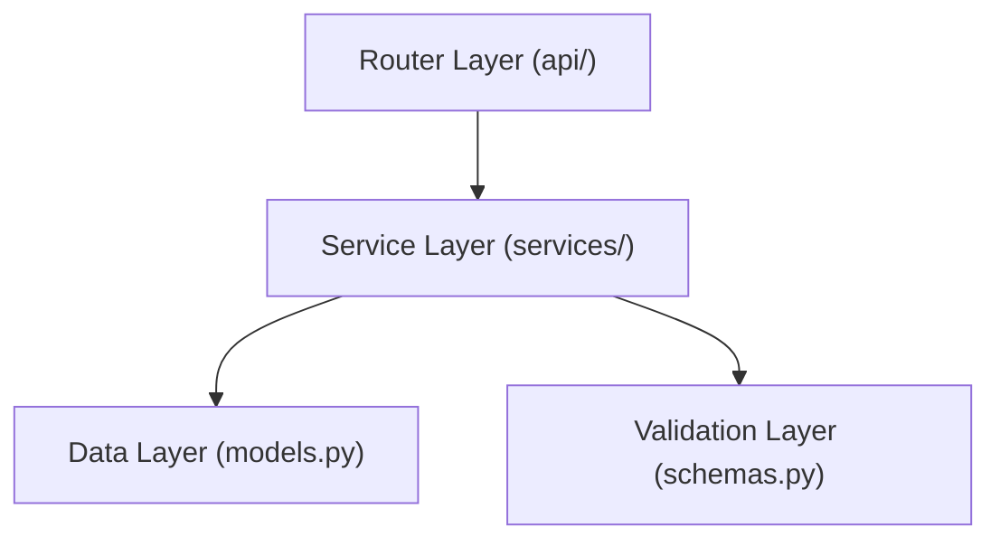

# Backend Architectural Guidelines

This document outlines the architectural patterns and best practices for the Libre-Q backend (FastAPI), ensuring consistency, maintainability, and scalability.

## 1. High-Level Architecture

Libre-Q follows a strict **Three-Tier Architecture** (also known as Controller-Service-Repository, though we treat Models as the data layer).



### 1.1 The Layers

1.  **Router Layer (`app/routers/`)**:
    *   **Responsibility**: Handle HTTP Request/Response mechanics, parsing parameters, and status codes.
    *   **Rule**: **NO Business Logic**. Routers should only call Services.
    *   **Output**: Returns Pydantic Schemas (`response_model`).

2.  **Service Layer (`app/services/`)**:
    *   **Responsibility**: Business logic, domain rules, validation beyond structure, and orchestration.
    *   **Rule**: Services accept Pydantic Schemas or primitives, and interact with SQLAlchemy Models. They should catch DB errors and raise application-specific exceptions if needed (or let global handlers catch them).
    *   **Dependency Injection**: Services are typically injected into Routers via `Depends()`.

3.  **Data Layer (`app/models.py`)**:
    *   **Responsibility**: Database schema definitions (SQLAlchemy).
    *   **Rule**: Rich models are encouraged (helper methods), but complex business rules belong in Services.

4.  **Validation Layer (`app/schemas.py`)**:
    *   **Responsibility**: Data validation and strict typing (Pydantic).
    *   **Rule**: All I/O must be typed. No `dict` or `Any` passing between layers unless strictly necessary.

## 2. Directory Structure

We group files by **Technical Type**, not by Domain (though domains are respected within filenames/folders where appropriate).

```text
backend/app/
├── core/           # Config, security, exceptions
├── middleware/     # Global middleware (CORS, error handling)
├── routers/        # HTTP Endpoints (admin/, auth.py, etc.)
├── schemas.py      # Pydantic models (Centralized for easy AI reading)
├── models.py       # SQLAlchemy models (Centralized for easy AI reading)
├── services/       # Business Logic (study_service.py, etc.)
└── main.py         # App entrypoint
```

> **Why Centralized Models/Schemas?**
> We found that for AI Agents, having a single source of truth for Types (`schemas.py`) and Database Structure (`models.py`) significantly reduces hallucination compared to scattered domain-based files.

## 3. Best Practices

### 3.1 Async/Sync

*   **FastAPI & IO**: We use `async def` for routers.
*   **SQLAlchemy**: We use **Async** SQLAlchemy (`AsyncSession`) for all database interactions. Ensure you use `await` for all DB calls.

### 3.2 Error Handling

Do not generic `try/except` blocks in routers. Let exceptions propagate.
*   **Use `HTTPException`** for expected user errors (400, 404).
*   **Global Handler**: `middleware/errors.py` automatically catches generic exclusions and formats 500 errors.

### 3.3 Dependency Injection

Use `Depends()` for:
*   Authentication (`get_current_user`)
*   Database Sessions (`get_db`)

## 4. Testing

*   **Integration Tests**: We prioritize integration tests in `tests/integration/` that hit valid endpoints.
*   **Fixture-Driven**: Use `conftest.py` extensively for setup/teardown of the DB state.
