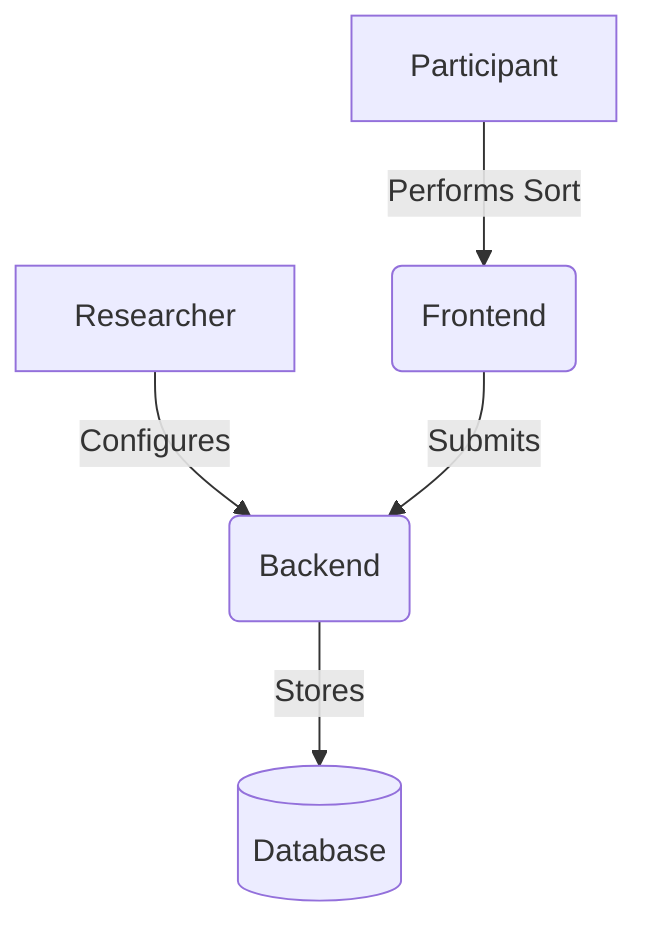

# Open-Q Documentation Roadmap

This document outlines the phased strategy for developing professional, comprehensive documentation for Open-Q.

## 🎯 Objectives

- Provide a clear **entry point** for new users and researchers.
- Enable developers to **contribute efficiently** with a deep understanding of the architecture.
- Maintain **consistency** across the codebase and user-facing materials.

## 👥 Target Audiences

| Audience         | Needs                                                    | Primary Docs                            |
| :--------------- | :------------------------------------------------------- | :-------------------------------------- |
| **Participants** | Instructions on how to complete a study.                 | In-app UI, Welcome Page.                |
| **Researchers**  | How to create, manage, and export studies.               | Researcher Guide, Study Config docs.    |
| **Developers**   | Architecture, setup, API specs, contribution guidelines. | Root README, ARCHITECTURE.md, API docs. |
| **DevOps**       | Deployment, environment variables, scaling.              | DEPLOYMENT.md, Root README.             |

---

## 🗺️ Implementation Phases

### Phase 1: Foundational Structure (Current)

- [ ] Define Root [README.md](file:///home/julien/open-q/README.md) as a landing portal.
- [ ] Create [ARCHITECTURE.md](file:///home/julien/open-q/docs/ARCHITECTURE.md) covering the tech stack and data flow.
- [ ] Establish a common style guide for documentation.

### Phase 2: User & Researcher Focus

- [ ] **Researcher Handbook**: Detailed guide on creating studies via `seed.py` or (future) UI.
- [ ] **Configuration Reference**: Exhaustive list of `grid_config`, `presort_config`, and `postsort_config` options.
- [ ] **Data Export Guide**: Explaining the resulting JSON/CSV structure.

### Phase 3: Technical Deep Dive

- [ ] **API Documentation**: Interactive Swagger/Redoc integration (FastAPI).
- [ ] **Frontend Component Library**: Documenting reusable UI components (CardStack, GridSort).
- [ ] **Testing Strategy**: Guide on writing backend and frontend tests.

### Phase 4: Maintenance & Automation

- [ ] CI/CD for documentation (e.g., auto-generating API docs).
- [ ] Internationalization (i18n) of documentation.

---

## 🎨 Diagram Standards

We use **Mermaid** for all technical diagrams to ensure they are version-controlled and easily editable.

