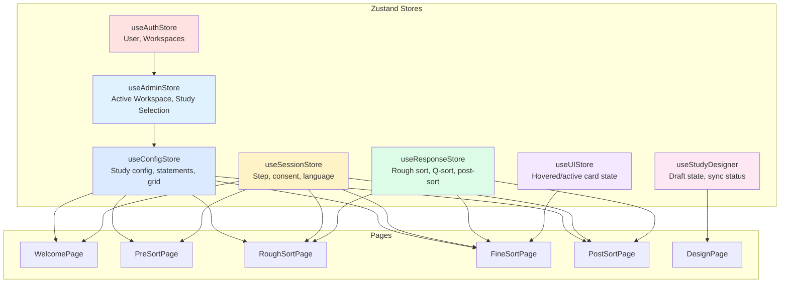
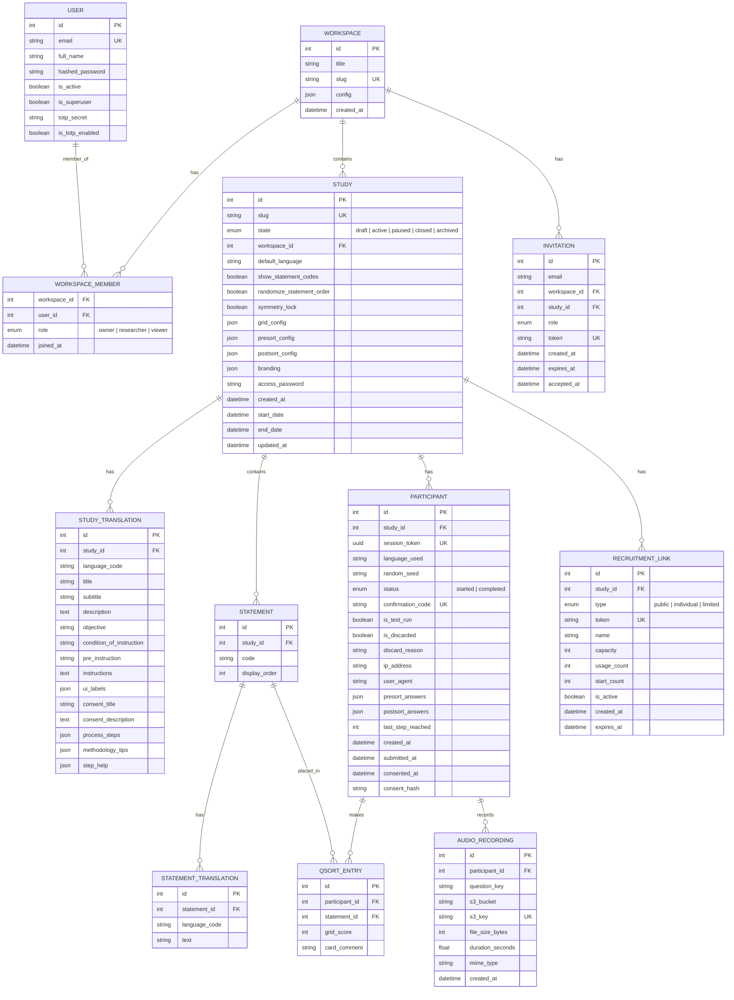
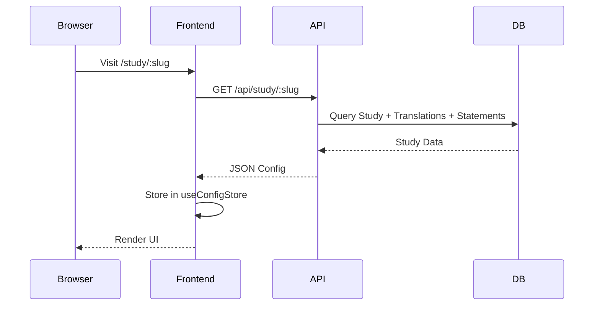
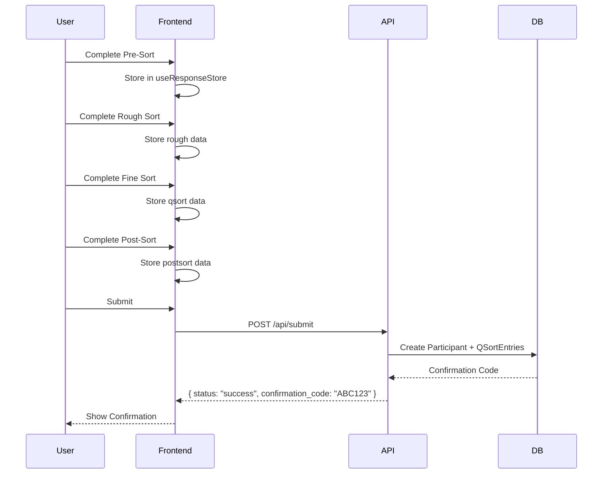

# Libre-Q Architecture

This document describes the technical architecture, design choices, and data flow of the Libre-Q platform.

---

## System Architecture

Libre-Q follows a decoupled **Client-Server** architecture with clear separation of concerns.

```mermaid
graph LR
    subgraph "Frontend (React + Vite)"
        UI[User Interface]
        State[Zustand Stores<br/>(Client State)]
        Query[TanStack Query<br/>(Server State)]
        I18N[i18next]
    end

    subgraph "Backend (FastAPI)"
        API[REST Endpoints]
        ORM[SQLAlchemy]
    end

    subgraph "Storage"
        DB[(PostgreSQL)]
    end

    UI <--> State
    UI <--> Query
    Query -->|REST| API
    API <--> ORM
    ORM <--> DB

    style API stroke:#3b82f6,stroke-width:2px
```

### Workspace-First Flow

Libre-Q 2.0 introduces a **Workspace-First** architecture.

- Most API requests are scoped by a mandatory `X-Workspace-ID` header.
- The `useAdminStore` maintains the global selection context (Active Workspace + Study) across all admin pages.
- Access control is inherited from the Workspace level, ensuring researchers only see the studies and data they are authorized to manage.

---

## State Management

The frontend uses a hybrid approach:

- **TanStack Query (via Orval)**: Manages async server state (caching, fetching, synchronizing).
- **Zustand**: Manages client-only state (drag-and-drop, UI, session progress).

Seven atomic stores are used for clean separation of concerns:



| Store                | Purpose                                       | Persisted            |
| -------------------- | --------------------------------------------- | -------------------- |
| `useAuthStore`       | Current authenticated user and workspace list | sessionStorage       |
| `useAdminStore`      | Active workspace and study selection context  | localStorage         |
| `useStudyDesigner`   | Draft study state, sync status, active step   | None (transient)     |
| `useConfigStore`     | Study configuration, statements, grid layout  | None                 |
| `useSessionStore`    | Current step, consent status, language        | localStorage         |
| `useResponseStore`   | Participant data (rough, qsort, postsort)     | localStorage         |
| `useUIStore`         | Transient UI state (hovered/active card)      | None                 |

### Session Isolation

When a participant navigates between studies (or the URL slug changes), all participant-facing stores (`useSessionStore`, `useConfigStore`, `useResponseStore`) are automatically reset and the TanStack Query cache is cleared. This prevents cross-contamination of data between studies.

In pilot/test mode, stores use separate localStorage keys (e.g., `libre-q-pilot-session` instead of `libre-q-session`) to isolate test data from real participant sessions.

### Context Providers

Beyond Zustand stores, the application uses React contexts for cross-cutting concerns:

| Context              | Purpose                                             |
| :------------------- | :-------------------------------------------------- |
| `ViewportProvider`   | Centralized breakpoint detection (`isMobile`, `isDesktop`) with SSR-safe defaults |
| `LayoutContext`      | Allows pages to inject custom actions into the admin header (e.g., save button) |

---

## Technology Stack

### Frontend

| Technology              | Purpose                              |
| ----------------------- | ------------------------------------ |
| **React 19** + **Vite** | Fast development with HMR            |
| **TypeScript**          | Type safety for Q-sort logic         |
| **TanStack Query**      | Server state management & caching    |
| **Orval**               | Contract-first API client generation |
| **Zustand**             | Minimal boilerplate state management |
| **Tailwind CSS**        | Utility-first styling                |
| **dnd-kit**             | Accessible drag-and-drop             |
| **Framer Motion**       | Smooth animations                    |
| **react-i18next**       | Internationalization                 |

### Backend

| Technology     | Purpose                           |
| -------------- | --------------------------------- |
| **FastAPI**    | Async REST API with OpenAPI docs  |
| **SQLAlchemy** | ORM with async support            |
| **Pydantic**   | Data validation and serialization |
| **PostgreSQL** | Scalable system database          |

---

## Responsiveness and Theming

Libre-Q implements a robust, multi-layer responsiveness strategy to support devices ranging from mobile phones to high-resolution desktops.

### 1. Centralized Viewport Detection

Instead of scattered `window.innerWidth` checks, the application uses a centralized **Viewport Context**.

- **`ViewportProvider`**: Listens for resize events and exposes standardized dimensions and semantic booleans (`isMobile`, `isDesktop`).
- **`useViewport()` Hook**: Components consume this hook to react to strict breakpoints consistently.
- **SSR Safety**: The context handles hydration mismatches gracefully by defaulting to desktop and updating on mount.

### 2. Fluid Typography

We utilize **Fluid Typography** to ensure text scales smoothly across viewport sizes, avoiding abrupt jumps at breakpoints.

- Implemented via `clamp()` functions in `src/styles/typography.css`.
- Integrated into Tailwind's configuration, so classes like `text-lg` automatically scale from mobile to desktop sizes.

### 3. Container Queries

For complex components that appear in various contexts (e.g., cards in a grid vs. a sidebar), we use **Container Queries**.

- **Plugin**: `@tailwindcss/container-queries`.
- **Usage**: Critical components (like `CardStack`) adapt their layout and font size based on their _container's_ width, not the viewport width.

---

## Database Schema



Study states: `draft`, `active`, `paused`, `closed`, `archived`.

### Key Data Integrity Patterns

- **Consent Hashing**: `consent_hash` stores a hash of the consent text version the participant saw, enabling audit trails.
- **IP Hashing**: `ip_address` stores a SHA-256 hash (salted with `IP_HASH_SALT`), never the raw IP — ensuring GDPR compliance.
- **Forward-Only Progress**: `last_step_reached` only advances forward, never regresses. This prevents participants from artificially rolling back their progress in analytics.
- **Deterministic Randomization**: When `randomize_statement_order` is enabled, the participant's `session_token` seeds the shuffle, so refreshing produces the same order.

---

## Permission Model (RBAC)

Libre-Q uses a two-tier RBAC system to balance global maintenance and fine-grained study collaboration.

### 1. Global Hierarchy

- **Superuser**: Can manage all users in the system and perform global maintenance. Designated by `is_superuser: true` on the `User` model.
- **User**: Standard account. Can be a member of one or more workspaces.

### 2. Workspace-Level Roles

Permissions are scoped per-workspace via the `WorkspaceMember` relationship:

| Role           | Ability                                                                 |
| :------------- | :---------------------------------------------------------------------- |
| **Owner**      | Full control over workspace: manage members, create/delete studies.     |
| **Researcher** | Can create/edit studies, export results. Cannot manage workspace users. |
| **Viewer**     | Read-only access to study configuration. Cannot export data.            |

---

## Data Lifecycle

### 1. Study Initialization



### 2. Sort & Submission



---

## Project Structure

```
frontend/src/
├── api/                # API Client (Orval-generated)
│   ├── generated.ts    # Generated hooks & types
│   ├── model/          # Generated Pydantic-to-TS schemas
│   └── mutator.ts      # Custom fetch wrapper
├── components/         # Reusable UI
│   ├── admin/          # Admin-specific UI
│   │   ├── analysis/   # ScreePlot, FactorLoadings, FactorArrays, Statements, Characteristics
│   │   ├── dashboard/  # InteractiveDataView, ParticipantDetail, charts/
│   │   ├── designer/   # Study design editor components
│   │   └── layout/     # Admin layout (sidebar, header)
│   ├── audio/          # Audio recording & playback
│   ├── postsort/       # Post-sort specific components
│   ├── survey/         # Survey form components
│   ├── ui/             # UI primitives (shadcn-style)
│   ├── GridSort.tsx    # Q-grid with zoom/pan
│   ├── CardStack.tsx   # Swipeable card deck
│   ├── SortableCard.tsx
│   ├── DroppableSlot.tsx
│   └── ReadingZone.tsx # Zoomed card display
├── contexts/           # React contexts (ViewportContext)
├── hooks/              # Custom React hooks
├── layouts/            # Shared layouts
├── lib/                # Utility functions (cn, etc.)
├── pages/              # Route components
│   ├── WelcomePage.tsx
│   ├── PreSortPage.tsx
│   ├── RoughSortPage.tsx
│   ├── FineSortPage.tsx
│   ├── PostSortPage.tsx
│   └── admin/          # Admin pages (Overview, Design, Data, Analysis, etc.)
├── schemas/            # Zod validation schemas
├── store/              # Zustand stores
│   ├── useAuthStore.ts
│   ├── useAdminStore.ts
│   ├── useStudyDesigner.ts
│   ├── useConfigStore.ts
│   ├── useSessionStore.ts
│   ├── useResponseStore.ts
│   └── useUIStore.ts
├── styles/             # Global CSS (typography, themes)
├── types/              # TypeScript type definitions
└── utils/              # Shared utilities

frontend/public/
└── locales/            # i18n translations
    ├── en/translation.json
    ├── fr/translation.json
    └── fi/translation.json
```

---

## API Endpoints

| Method | Endpoint           | Description                   |
| ------ | ------------------ | ----------------------------- |
| `GET`  | `/api/study/:slug` | Fetch study configuration     |
| `POST` | `/api/submit`      | Submit participant data       |
| `GET`  | `/api/admin/*`     | Administrative API (auth required) |
| `POST` | `/api/audio/*`     | Audio recording management    |
| `GET`  | `/docs`            | Interactive API documentation |

For the complete API reference, see [docs/reference/api.md](../reference/api.md) or visit `/docs` when the backend is running.

---

## Error Handling

### Backend

All errors are handled by a global exception middleware that returns a standardized JSON format:

```json
{
  "code": 422,
  "message": "Validation Error",
  "details": [ ... ]
}
```

Error categories:
- **HTTP exceptions**: Returned with their status code and message.
- **Validation errors**: Include Pydantic field-level details.
- **Database integrity errors**: Return conflict details (e.g., duplicate slug).
- **Unhandled exceptions**: Logged with full traceback; clients receive a generic 500.

### Frontend

Frontend JavaScript errors are captured and sent to `POST /api/logs` with stack trace, URL, and context metadata. The backend logs these to a dedicated `frontend_error` logger for monitoring.

---

## Security

### Security Headers

The backend injects security headers on all responses:

- **HSTS**: Enforces HTTPS connections.
- **CSP (Content Security Policy)**: Restricts script sources; dynamically includes S3 endpoint for audio playback.
- **X-Frame-Options**: Prevents clickjacking (DENY).
- **Permissions-Policy**: Restricts camera access; enables microphone for audio recording.

### Password Security

User passwords are hashed with bcrypt using auto-generated salts. TOTP 2FA codes use a 1-second time window tolerance for clock skew.
