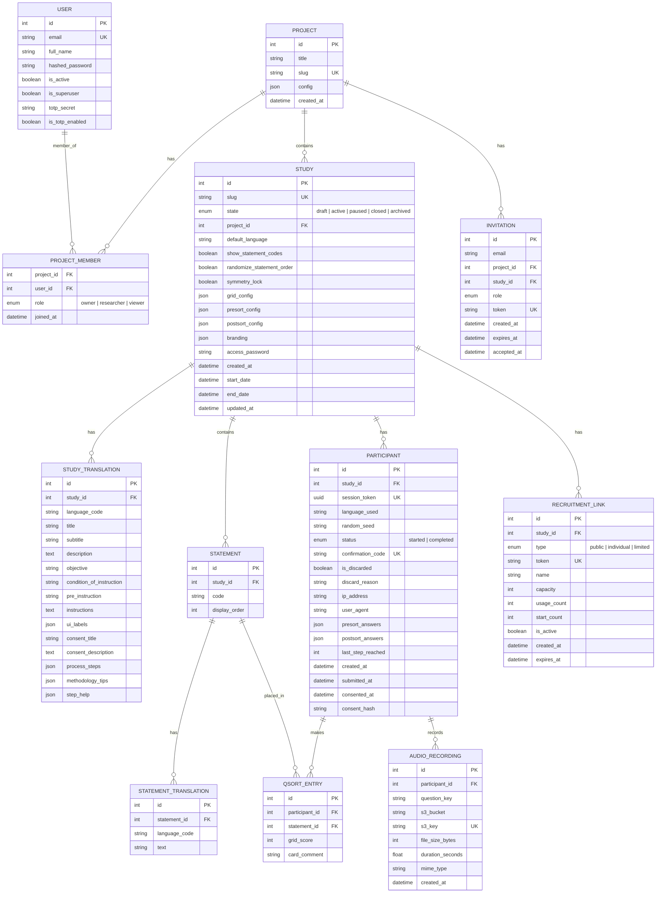
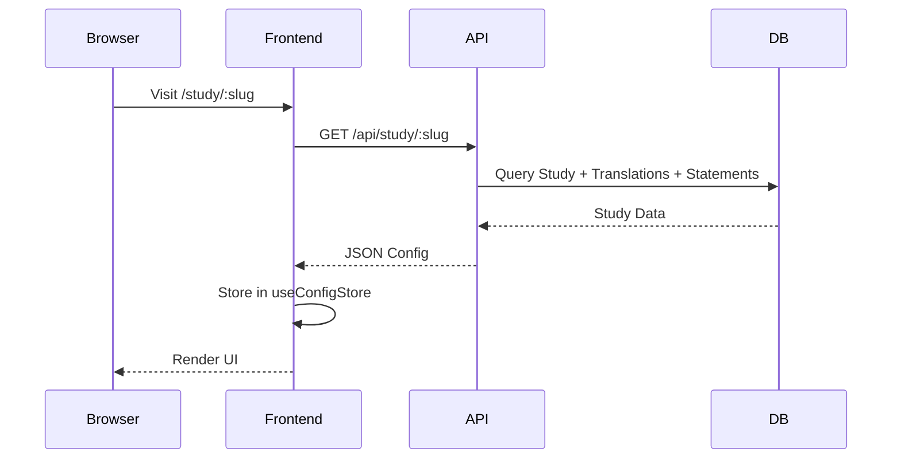
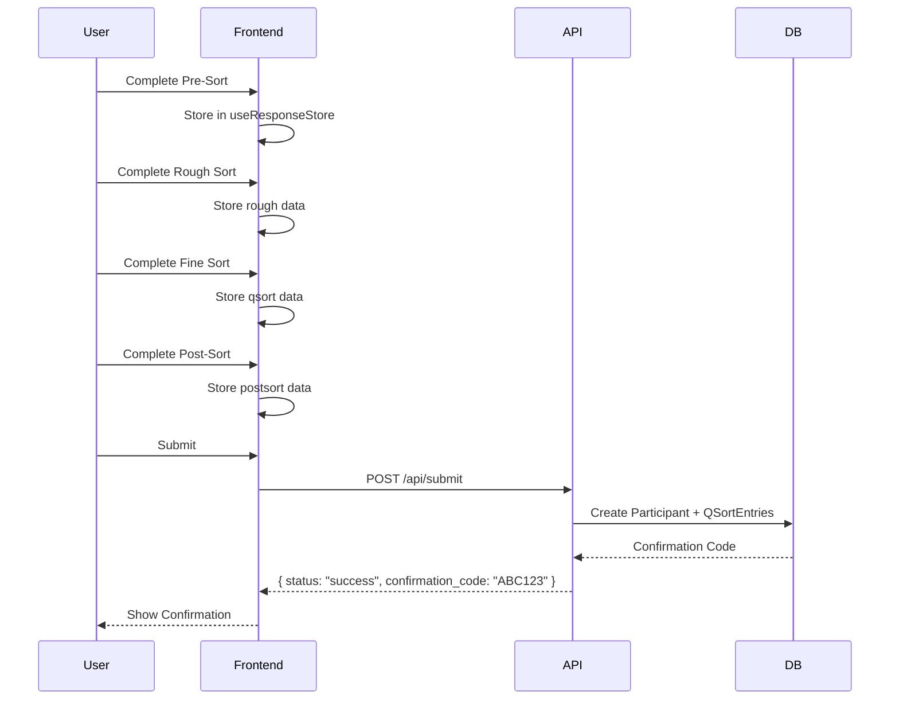

# Qualis Architecture

This document describes the technical architecture, design choices, and data flow of the Qualis platform.

---

## System Architecture

Qualis follows a decoupled **Client-Server** architecture with clear separation of concerns.

```mermaid
graph LR
    subgraph "Frontend (React + Vite)"
        UI[User Interface]
        State[Zustand Stores<br/>(Client State)]
        Query[TanStack Query<br/>(Server State)]
        I18N[i18next]
    end

    subgraph "Backend (FastAPI)"
        API[REST Endpoints]
        ORM[SQLAlchemy]
    end

    subgraph "Storage"
        DB[(PostgreSQL)]
    end

    UI <--> State
    UI <--> Query
    Query -->|REST| API
    API <--> ORM
    ORM <--> DB

    style API stroke:#3b82f6,stroke-width:2px
```

### Project-First Flow

Qualis 2.0 introduces a **Project-First** architecture.

- Most API requests are scoped by a mandatory `X-Project-ID` header.
- The `useAdminStore` maintains the global selection context (Active Project + Study) across all admin pages.
- Access control is inherited from the Project level, ensuring researchers only see the studies and data they are authorized to manage.

---

## State Management

The frontend uses a hybrid approach:

- **TanStack Query (via Orval)**: Manages async server state (caching, fetching, synchronizing).
- **Zustand**: Manages client-only state (drag-and-drop, UI, session progress).

Seven atomic stores are used for clean separation of concerns:


| Store                | Purpose                                       | Persisted            |
| -------------------- | --------------------------------------------- | -------------------- |
| `useAuthStore`       | Current authenticated user and project list   | sessionStorage       |
| `useAdminStore`      | Active project and study selection context    | localStorage         |
| `useStudyDesigner`   | Draft study state, sync status, active step   | None (transient)     |
| `useConfigStore`     | Study configuration, statements, grid layout  | None                 |
| `useSessionStore`    | Current step, consent status, language        | localStorage         |
| `useResponseStore`   | Participant data (rough, qsort, postsort)     | localStorage         |
| `useUIStore`         | Transient UI state (hovered/active card)      | None                 |

### Session Isolation

When a participant navigates between studies (or the URL slug changes), all participant-facing stores (`useSessionStore`, `useConfigStore`, `useResponseStore`) are automatically reset and the TanStack Query cache is cleared. This prevents cross-contamination of data between studies.

In pilot/test mode, stores use separate localStorage keys (e.g., `qualis-pilot-session` instead of `qualis-session`) to isolate test data from real participant sessions.

### Context Providers

Beyond Zustand stores, the application uses React contexts for cross-cutting concerns:

| Context              | Purpose                                             |
| :------------------- | :-------------------------------------------------- |
| `ViewportProvider`   | Centralized breakpoint detection (`isMobile`, `isDesktop`) with SSR-safe defaults |
| `LayoutContext`      | Allows pages to inject custom actions into the admin header (e.g., save button) |

---

## Technology Stack

### Frontend

| Technology              | Purpose                              |
| ----------------------- | ------------------------------------ |
| **React 19** + **Vite** | Fast development with HMR            |
| **TypeScript**          | Type safety for Q-sort logic         |
| **TanStack Query**      | Server state management & caching    |
| **Orval**               | Contract-first API client generation |
| **Zustand**             | Minimal boilerplate state management |
| **Tailwind CSS**        | Utility-first styling                |
| **dnd-kit**             | Accessible drag-and-drop             |
| **Framer Motion**       | Smooth animations                    |
| **react-i18next**       | Internationalization                 |

### Backend

| Technology     | Purpose                           |
| -------------- | --------------------------------- |
| **FastAPI**    | Async REST API with OpenAPI docs  |
| **SQLAlchemy** | ORM with async support            |
| **Pydantic**   | Data validation and serialization |
| **PostgreSQL** | Scalable system database          |

---

## Responsiveness and Theming

Qualis implements a robust, multi-layer responsiveness strategy to support devices ranging from mobile phones to high-resolution desktops.

### 1. Centralized Viewport Detection

Instead of scattered `window.innerWidth` checks, the application uses a centralized **Viewport Context**.

- **`ViewportProvider`**: Listens for resize events and exposes standardized dimensions and semantic booleans (`isMobile`, `isDesktop`).
- **`useViewport()` Hook**: Components consume this hook to react to strict breakpoints consistently.
- **SSR Safety**: The context handles hydration mismatches gracefully by defaulting to desktop and updating on mount.

### 2. Fluid Typography

We utilize **Fluid Typography** to ensure text scales smoothly across viewport sizes, avoiding abrupt jumps at breakpoints.

- Implemented via `clamp()` functions in `src/styles/typography.css`.
- Integrated into Tailwind's configuration, so classes like `text-lg` automatically scale from mobile to desktop sizes.

### 3. Container Queries

For complex components that appear in various contexts (e.g., cards in a grid vs. a sidebar), we use **Container Queries**.

- **Plugin**: `@tailwindcss/container-queries`.
- **Usage**: Critical components (like `CardStack`) adapt their layout and font size based on their _container's_ width, not the viewport width.

---

## Database Schema



Study states: `draft`, `active`, `paused`, `closed`, `archived`.

### Key Data Integrity Patterns

- **Consent Hashing**: `consent_hash` stores a hash of the consent text version the participant saw, enabling audit trails.
- **IP Hashing**: `ip_address` stores a SHA-256 hash (salted with `IP_HASH_SALT`), never the raw IP — ensuring GDPR compliance.
- **Forward-Only Progress**: `last_step_reached` only advances forward, never regresses. This prevents participants from artificially rolling back their progress in analytics.
- **Deterministic Randomization**: When `randomize_statement_order` is enabled, the participant's `session_token` seeds the shuffle, so refreshing produces the same order.

---

## Permission Model (RBAC)

Qualis uses a two-tier RBAC system to balance global maintenance and fine-grained study collaboration.

### 1. Global Hierarchy

- **Superuser**: Can manage all users in the system and perform global maintenance. Designated by `is_superuser: true` on the `User` model.
- **User**: Standard account. Can be a member of one or more projects.

### 2. Project-Level Roles

Permissions are scoped per-project via the `ProjectMember` relationship:

| Role           | Ability                                                                 |
| :------------- | :---------------------------------------------------------------------- |
| **Owner**      | Full control over project: manage members, create/delete studies.       |
| **Researcher** | Can create/edit studies, export results. Cannot manage project users.   |
| **Viewer**     | Read-only access to study configuration. Cannot export data.            |

---

## Data Lifecycle

### 1. Study Initialization



### 2. Sort & Submission



---

## Where to find what

Conventions for the code layout live in the contributing guides, not here. See [`../contributing/backend-guidelines.md`](../contributing/backend-guidelines.md) for the backend's three-tier organisation (`routers` → `services` → `models`/`schemas`) and [`../reference/components.md`](../reference/components.md) for the frontend component map. The full HTTP API surface is documented in [`../reference/api.md`](../reference/api.md).

---

## Why this shape

The architectural choices visible above (project-scoped requests, hybrid Zustand + TanStack Query, contract-first OpenAPI generation, async SQLAlchemy, JSON columns for open-ended config, hashed IPs, persisted analysis runs) are not neutral. They follow from three commitments that override the "default" answer at each junction:

1. **Self-hosting under a researcher's institution.** A SaaS architecture would have made several design decisions easier (centralised auth, shared object storage, fewer env vars). Self-hosting with GDPR data-residency in mind dictates that secrets, hashing salts, S3 endpoints, and SMTP routing all stay configurable per deployment, and that the participant flow contains no third-party calls.

2. **Critical Q-methodology rather than classical Q-as-a-tool.** The persistence of every analysis run with its parameters, the editability of researcher notes on a run, the per-statement audit of who flagged what — these only make sense if you treat analytical choices as part of the result, rather than as a one-shot computation. The schema is shaped to keep the trail.

3. **Auditable handling of participant data.** IP hashing with a per-deployment salt, consent-version hashes per participant, forward-only `last_step_reached`, deterministic randomisation seeded by the session token, and admin- and participant-mediated GDPR Art. 17 erasure are not features added on top — they are constraints that ruled out simpler implementations from the start.

For the runtime defaults that fall out of these commitments (rate-limiting modes, connection pool sizing, security headers, error response shape), see [`../guides/deployment.md#runtime-behaviour-reference`](../guides/deployment.md#runtime-behaviour-reference) and [`../reference/api.md#error-response-format`](../reference/api.md#error-response-format).
