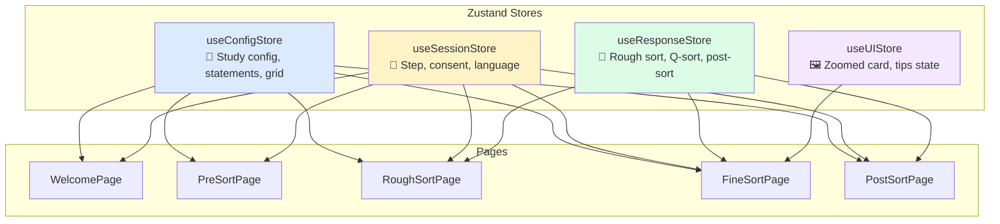
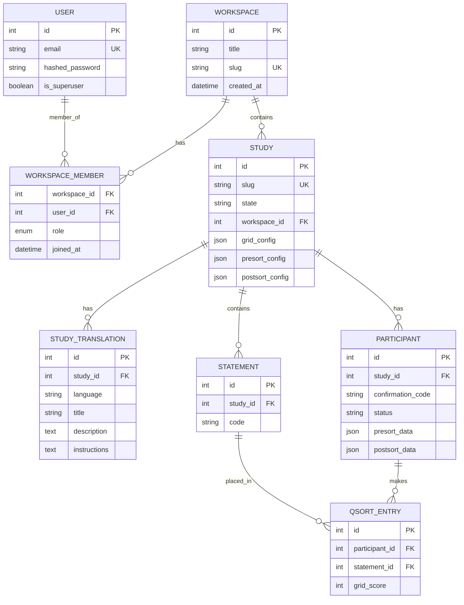
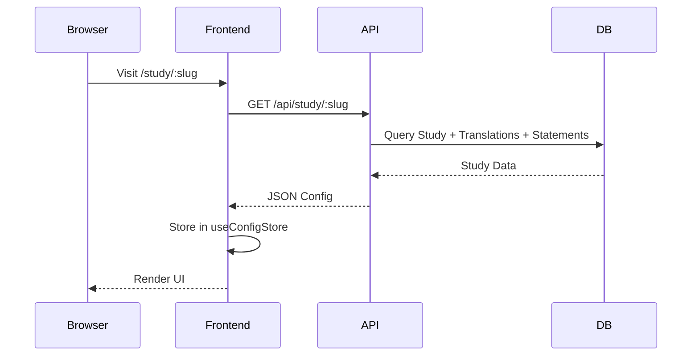
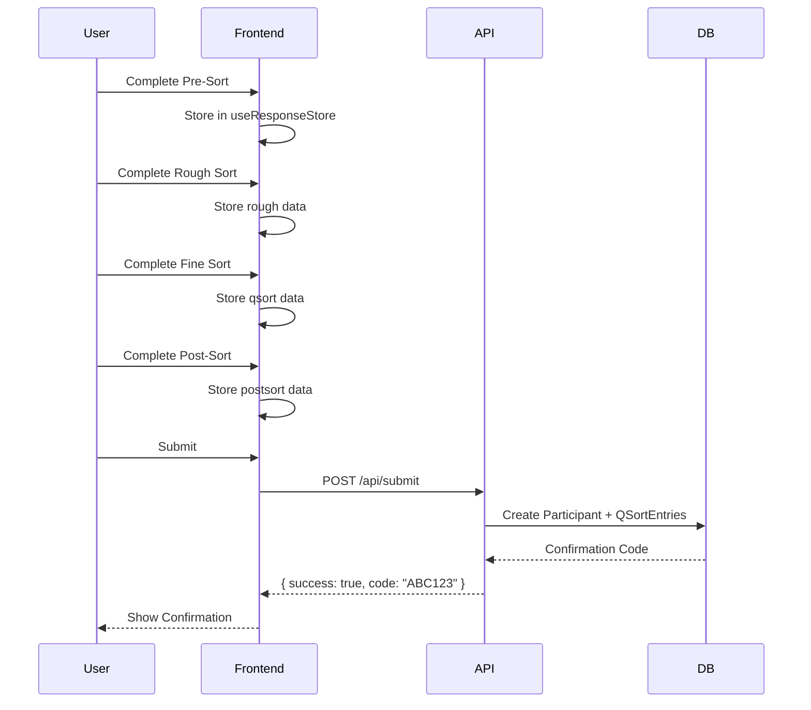

# Open-Q Architecture

This document describes the technical architecture, design choices, and data flow of the Open-Q platform.

---

## 🏗️ System Architecture

Open-Q follows a decoupled **Client-Server** architecture with clear separation of concerns.

```mermaid
graph LR
    subgraph "Frontend (React + Vite)"
        UI[User Interface]
        State[Zustand Stores<br/>(Client State)]
        Query[TanStack Query<br/>(Server State)]
        I18N[i18next]
    end

    subgraph "Backend (FastAPI)"
        API[REST Endpoints]
        ORM[SQLAlchemy]
    end

    subgraph "Storage"
        DB[(PostgreSQL)]
    end

    UI <--> State
    UI <--> Query
    Query -->|REST| API
    API <--> ORM
    ORM <--> DB
```

---

## 💾 State Management

The frontend uses a hybrid approach:

- **TanStack Query (via Orval)**: Manages async server state (caching, fetching, synchronizing).
- **Zustand**: Manages client-only state (drag-and-drop, UI, session progress).

Three atomic stores are used for clean separation of concerns:



| Store              | Purpose                                      | Persisted       |
| ------------------ | -------------------------------------------- | --------------- |
| `useConfigStore`   | Study configuration, statements, grid layout | ❌              |
| `useSessionStore`  | Current step, consent status, language       | ✅ localStorage |
| `useResponseStore` | Participant data (rough, qsort, postsort)    | ✅ localStorage |
| `useUIStore`       | Transient UI state (zoomed card)             | ❌              |

---

## 💻 Technology Stack

### Frontend

| Technology              | Purpose                              |
| ----------------------- | ------------------------------------ |
| **React 19** + **Vite** | Fast development with HMR            |
| **TypeScript**          | Type safety for Q-sort logic         |
| **TanStack Query**      | Server state management & caching    |
| **Orval**               | Contract-first API client generation |
| **Zustand**             | Minimal boilerplate state management |
| **Tailwind CSS**        | Utility-first styling                |
| **dnd-kit**             | Accessible drag-and-drop             |
| **Framer Motion**       | Smooth animations                    |
| **react-i18next**       | Internationalization                 |

### Backend

| Technology     | Purpose                           |
| -------------- | --------------------------------- |
| **FastAPI**    | Async REST API with OpenAPI docs  |
| **SQLAlchemy** | ORM with async support            |
| **Pydantic**   | Data validation and serialization |
| **PostgreSQL** | Scalable system database          |

---

## 📊 Database Schema



---

## 🔐 Permission Model (RBAC)

Open-Q uses a two-tier RBAC system to balance global maintenance and fine-grained study collaboration.

### 1. Global Hierarchy

- **Superuser**: Can manage all users in the system and perform global maintenance. Designated by `is_superuser: true` on the `User` model.
- **User**: Standard account. Can be a member of one or more workspaces.

### 2. Workspace-Level Roles

Permissions are scoped per-workspace via the `WorkspaceMember` relationship:

| Role           | Ability                                                                 |
| :------------- | :---------------------------------------------------------------------- |
| **Admin**      | Full control over workspace: manage members, create/delete studies.     |
| **Researcher** | Can create/edit studies, export results. Cannot manage workspace users. |
| **Viewer**     | Read-only access to study configuration and results export.             |

---

## 🔄 Data Lifecycle

### 1. Study Initialization



### 2. Sort & Submission



---

## 📁 Project Structure

```
frontend/src/
├── api/                # API Client (Orval)
│   ├── generated.ts    # Generated hooks & types
│   ├── model/          # Generated schemas
│   └── mutator.ts      # Custom fetch wrapper
├── test/               # Test utilities & mocks
│   ├── test-utils.tsx  # Custom render & providers
│   └── server.ts       # MSW server setup
├── pages/              # Route components
│   ├── WelcomePage.tsx
│   ├── PreSortPage.tsx
│   ├── RoughSortPage.tsx
│   ├── FineSortPage.tsx
│   └── PostSortPage.tsx
├── components/         # Reusable UI
│   ├── GridSort.tsx    # Q-grid with zoom/pan
│   ├── CardStack.tsx   # Swipeable card deck
│   ├── SortableCard.tsx
│   └── DroppableSlot.tsx
├── hooks/              # Custom React hooks
│   ├── useGetStudyConfig.ts # Generated hook wrapper
│   ├── useGridZoom.ts  # Zoom/pan logic
│   ├── useFineSortDrag.ts
│   └── useStudyConfig.ts
├── store/              # Zustand stores
│   ├── useConfigStore.ts
│   ├── useSessionStore.ts
│   ├── useResponseStore.ts
│   └── useUIStore.ts
└── layouts/            # Shared layouts

frontend/public/
└── locales/            # i18n translations
    ├── en/translation.json
    ├── fr/translation.json
    └── fi/translation.json
```

---

## 🔌 API Endpoints

| Method | Endpoint           | Description                   |
| ------ | ------------------ | ----------------------------- |
| `GET`  | `/api/study/:slug` | Fetch study configuration     |
| `POST` | `/api/submit`      | Submit participant data       |
| `GET`  | `/docs`            | Interactive API documentation |

For full API reference, visit `/docs` when the backend is running.
