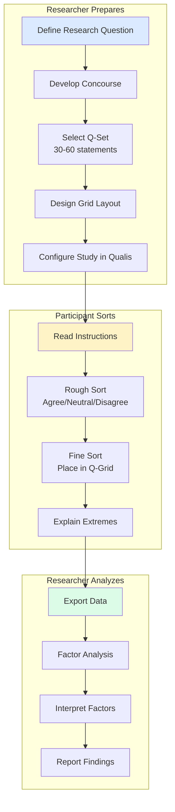

# Q-methodology: a researcher's guide

Q-methodology is a research approach for studying **subjectivity**: how people think about topics from their own perspective. Qualis provides the digital infrastructure to conduct Q-studies online. It offers affordances for both **classical Brown-style analysis** (Stephenson 1953; Brown 1980) and the **reflexive practices** in the lineage of Stainton Rogers (1997), Stenner (2011), and Sneegas (2020) — without committing you to either school.

If you're new to Q-methodology, the rest of this document is an introduction. If you already practice it, the most useful section is probably ["Where Qualis sits"](#where-qualis-sits) below, which states what Qualis implements, what it keeps accessible to the analyst, and why.

---

## What is Q-methodology?

Q-methodology was developed by psychologist **William Stephenson** in 1935 as a way to study human subjectivity scientifically. Unlike surveys that count how many people agree with statements, Q-methodology reveals **patterns of viewpoints** across a population. The factor analysis is performed on the *participants* (not the variables), grouping individuals who share a similar pattern of preferences across the statement set.

### Key concepts

| Term          | Definition                                                                                            |
| ------------- | ----------------------------------------------------------------------------------------------------- |
| **Q-Sort**    | The process of ranking statements along a continuum from "Most Unlike My View" to "Most Like My View" |
| **Concourse** | The full set of possible statements about a topic                                                     |
| **Q-Set**     | A representative subset of statements used in the study (typically 30-60)                             |
| **P-Set**     | The group of participants who complete the Q-sort                                                     |
| **Factor**    | A distinct pattern of viewpoints shared by multiple participants                                      |
| **Loading**   | The numerical degree to which a participant's Q-sort correlates with a factor                         |
| **Flagging**  | Deciding which participants "define" a factor (significantly load on it and only it)                  |
| **Z-score**   | Statement position in the synthetic Q-sort representing a factor                                      |
| **Distinguishing statement** | A statement that scores significantly differently on this factor vs others                |
| **Consensus statement** | A statement that scores similarly across all factors (shared view)                              |

---

## How Q-methodology works



---

## The Q-grid

The **Q-grid** is a forced quasi-normal distribution where participants place statements. The most common grid shapes are:

### Standard distribution (11-point scale, 36 statements)

```
     -5  -4  -3  -2  -1   0  +1  +2  +3  +4  +5
     ┌───┬───┬───┬───┬───┬───┬───┬───┬───┬───┬───┐
     │   │   │   │   │   │   │   │   │   │   │   │
     │   │   │   │   ├───┼───┼───┤   │   │   │   │
     │   │   ├───┼───┼───┼───┼───┼───┼───┤   │   │
     │   ├───┼───┼───┼───┼───┼───┼───┼───┼───┤   │
     └───┴───┴───┴───┴───┴───┴───┴───┴───┴───┴───┘
      2   3   4   5   6   7   6   5   4   3   2  = 47 places
```

### Compact distribution (7-point scale, 20 statements)

```
         -3  -2  -1   0  +1  +2  +3
         ┌───┬───┬───┬───┬───┬───┬───┐
         │   │   ├───┼───┼───┤   │   │
         │   ├───┼───┼───┼───┼───┤   │
         ├───┼───┼───┼───┼───┼───┼───┤
         └───┴───┴───┴───┴───┴───┴───┘
          2   3   4   5   4   3   2   = 23 places
```

### Forced, free, and flexible distributions

The grid above is a *forced* distribution — every column must hold its declared capacity at submission. This is the Brown-school default and the one most published Q studies use, because the trade-offs participants commit to are what makes Q-sorts directly comparable across people.

A *free* distribution drops the per-column constraint. Participants must still place every statement, but columns can absorb overflow. The slot counts are an upper hint rather than a rule. Researchers in the reflexive tradition sometimes prefer this on the grounds that the forced shape imposes a structure on subjectivity rather than measuring it (Watts & Stenner 2012, ch. 4; Brown et al. 2015).

Qualis also offers a *flexible* mode that keeps the total enforced but treats per-column capacities as soft hints with a designer warning — a compromise between forced and free.

---

## Qualis study phases

Qualis breaks the Q-sort into manageable phases:

### 1. Pre-sort (optional)

Collect demographic or contextual information about participants.

### 2. Rough sort

Participants quickly categorize all statements into three piles:

- **Agree:** statements that resonate with their view
- **Neutral:** no strong opinion
- **Disagree:** statements that don't represent their view

### 3. Fine sort

Participants place cards from each pile onto the Q-grid pyramid, forcing nuanced distinctions.

### 4. Post-sort

Participants explain why they placed their most extreme statements (e.g., +5 and -5) where they did.

---

For the JSON shape used to declare a Q-grid in Qualis, see the [Configuration reference](../reference/configuration.md).

---

## Two strands of Q

Q-methodology has historically split into two strands, and the choice between them shapes how a study is designed, analysed, and written up. The next section explains where Qualis sits relative to that split.

### Where Qualis sits

**Classical Q** (Stephenson, Brown 1980, 1993) treats the method as a quantitative, hypothesis-testing tool. The **reflexive tradition** (Stainton Rogers 1997; Stenner 2011; Watts & Stenner 2012; Sneegas 2020) reframes it as an interpretive practice: the method's value comes from making subjectivities legible, not from extracting "the truth" about opinions, and the researcher's analytical choices (rotation, flagging thresholds, factor naming) are themselves moves to be examined and disclosed.

Qualis provides affordances for **both** strands. Extraction, rotation, and export support conventional Brown-style analytical workflows; alongside them, provenance records, editable analysis runs, collaborative memos, and participant-response panels keep the interpretive material beside the factor tables. Qualis does not replace judgmental rotation or abductive factor interpretation — it keeps the relevant evidence and reasoning accessible while the analyst makes those choices. The features below are framed around the **reflexive needs** because that is where the design goes beyond what classical Q tools (PQMethod, qmethod-R, Ken-Q) directly target; none of them constrains a classical workflow.

### What this means in practice

| Reflexive / transparency need | How Qualis supports it |
|-------------------------------|--------------------------|
| Transparency of analytical choices | Every analysis run is persisted with the choices that produced it — extraction method, number of factors, rotation, flagging mode, and any judgmental rotations. Researchers can audit what was changed when, and explain those choices in their methods section. The reliability coefficient behind composite reliability and the standard errors is held at the qmethod-R / Brown (1980) default (`av_rel_coef` = 0.8) rather than being a per-study setting. |
| Researcher control over flagging | Auto-flagging is a starting point. Flagging is exposed and editable per study, and researcher decisions are part of the audit trail. |
| Integration of participant voice | Post-sort recordings (audio + free-text) are stored alongside the Q-sort and are linkable to factor membership in the analysis interface. This supports the reflexive practice of grounding factor interpretation in the words of the people who define each factor (Sneegas 2020; Robbins & Krueger 2000). |
| Reflexivity about the P-set | The recruitment funnel records who was invited, who started, who completed, and from which channel. The constructed nature of the P-set is visible rather than implicit. |
| Multilingual studies | Statements, instructions, consent text, and the participant UI can be translated. Cross-cultural and multi-site Q research often crosses language boundaries; this should not require reverse-engineering the platform. |
| Self-hosted data residency | Qualis runs on the researcher's infrastructure; participant data does not transit through a third-party SaaS. Important for GDPR compliance, ethics committees, and the trust relationship with participants. |

For the running list of implemented analytical features and their parameters, see the [Analysis section of the Admin Dashboard reference](../reference/admin-dashboard.md#analysis). For the comparison with PQMethod, qmethod-R, KADE, FlashQ/HTMLQ, and Ken-Q, see the capability table in the project [README](../../README.md#comparison-with-existing-tools).

### Rotation: automatic and judgmental

Stainton Rogers (1997) and Watts & Stenner (2012) describe manual (judgmental) rotation as a moment where the researcher exercises explicit interpretive judgment. Qualis supports both **Varimax** (automatic) and **judgmental** rotation. A judgmental run applies a sequence of paired-factor rotations in order; the sequence is persisted with the analysis run, so the rotation path is part of the audit trail and can be documented in a methods section. Researchers who prefer to rotate elsewhere can still export the Q-sort matrix in PQMethod or R `qmethod` format, perform the rotation there, and bring the result back.

### On the roadmap

Some extensions remain on the roadmap rather than in the current release — for example image-based statements (building on existing visual Q practice) and post-study participant communication channels. These are planned to keep the same project, study, participant, and export boundaries.

---

## Further reading

### Classical Q-methodology

- Stephenson, W. (1953). _The Study of Behavior: Q-Technique and its Methodology_. University of Chicago Press.
- Brown, S. R. (1980). _Political Subjectivity: Applications of Q Methodology in Political Science_. Yale University Press.
- Brown, S. R. (1993). A Primer on Q Methodology. _Operant Subjectivity_, 16(3/4), 91–138. https://doi.org/10.22488/okstate.93.100504

### Reflexive and interpretive Q-methodology

- Stainton Rogers, R. (1997). Q Methodology and "Going Critical": Some Reflections on the British Dialect. _Operant Subjectivity_, 21(1/2). https://doi.org/10.22488/okstate.97.100545
- Robbins, P., & Krueger, R. (2000). Beyond Bias? The Promise and Limits of Q Method in Human Geography. _The Professional Geographer_, 52(4), 636–648. https://doi.org/10.1111/0033-0124.00252
- Stenner, P. (2011). Q Methodology as Qualiquantology. _Operant Subjectivity_, 35(1). https://doi.org/10.22488/okstate.11.100593
- Watts, S., & Stenner, P. (2012). _Doing Q Methodological Research: Theory, Method and Interpretation_. SAGE Publications. https://doi.org/10.4135/9781446251911
- Sneegas, G. (2020). Making the Case for Critical Q Methodology. _The Professional Geographer_, 72(1), 78–87. https://doi.org/10.1080/00330124.2019.1598271
- Ormerod, K. J. (2019). Toilet power: potable water reuse and the situated meaning of sustainability in the southwestern United States. _Journal of Political Ecology_, 26(1). https://doi.org/10.2458/v26i1.23257

### Software references

- Schmolck, P. PQMethod manual (canonical desktop analysis software, classical lineage).
- Banasick, S. (2019). KADE: A desktop application for Q methodology. _Journal of Open Source Software_, 4(36), 1360. https://doi.org/10.21105/joss.01360
- Zabala, A. (2014). qmethod: A Package to Explore Human Perspectives Using Q Methodology. _The R Journal_, 6(2), 163–173. https://doi.org/10.32614/rj-2014-032
- [Q Methodology Network](https://qmethod.org/)

---

## Next steps

- [Creating Studies](../guides/conducting-studies.md)
- [Study Configuration](../reference/configuration.md)
- [Exporting Data](../guides/data-export.md)
