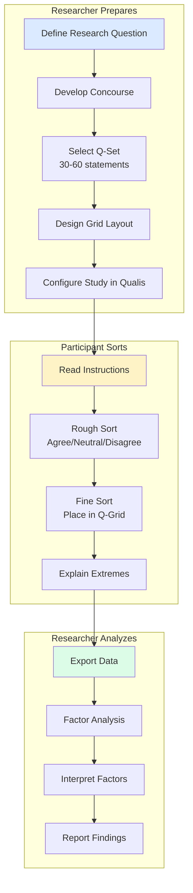

# Q-methodology: a researcher's guide

Q-methodology is a research approach for studying **subjectivity**: how people think about topics from their own perspective. Qualis provides the digital infrastructure to conduct Q-studies online, with design choices oriented toward **critical Q-methodology** (Stainton Rogers 1997; Stenner 2011; Watts & Stenner 2012; Sneegas 2020).

If you're new to Q-methodology, the rest of this document is an introduction. If you already practice it, the most useful section is probably ["Critical Q-methodology in Qualis"](#critical-q-methodology-in-libre-q) below, which states what Qualis implements, what it defers, and why.

---

## What is Q-methodology?

Q-methodology was developed by psychologist **William Stephenson** in 1935 as a way to study human subjectivity scientifically. Unlike surveys that count how many people agree with statements, Q-methodology reveals **patterns of viewpoints** across a population. The factor analysis is performed on the *participants* (not the variables), grouping individuals who share a similar pattern of preferences across the statement set.

### Key concepts

| Term          | Definition                                                                                            |
| ------------- | ----------------------------------------------------------------------------------------------------- |
| **Q-Sort**    | The process of ranking statements along a continuum from "Most Unlike My View" to "Most Like My View" |
| **Concourse** | The full set of possible statements about a topic                                                     |
| **Q-Set**     | A representative subset of statements used in the study (typically 30-60)                             |
| **P-Set**     | The group of participants who complete the Q-sort                                                     |
| **Factor**    | A distinct pattern of viewpoints shared by multiple participants                                      |
| **Loading**   | The numerical degree to which a participant's Q-sort correlates with a factor                         |
| **Flagging**  | Deciding which participants "define" a factor (significantly load on it and only it)                  |
| **Z-score**   | Statement position in the synthetic Q-sort representing a factor                                      |
| **Distinguishing statement** | A statement that scores significantly differently on this factor vs others                |
| **Consensus statement** | A statement that scores similarly across all factors (shared view)                              |

---

## How Q-methodology works



---

## The Q-grid

The **Q-grid** is a forced quasi-normal distribution where participants place statements. The most common grid shapes are:

### Standard distribution (11-point scale, 36 statements)

```
     -5  -4  -3  -2  -1   0  +1  +2  +3  +4  +5
     ┌───┬───┬───┬───┬───┬───┬───┬───┬───┬───┬───┐
     │   │   │   │   │   │   │   │   │   │   │   │
     │   │   │   │   ├───┼───┼───┤   │   │   │   │
     │   │   ├───┼───┼───┼───┼───┼───┼───┤   │   │
     │   ├───┼───┼───┼───┼───┼───┼───┼───┼───┤   │
     └───┴───┴───┴───┴───┴───┴───┴───┴───┴───┴───┘
      2   3   4   5   6   7   6   5   4   3   2  = 47 places
```

### Compact distribution (7-point scale, 20 statements)

```
         -3  -2  -1   0  +1  +2  +3
         ┌───┬───┬───┬───┬───┬───┬───┐
         │   │   ├───┼───┼───┤   │   │
         │   ├───┼───┼───┼───┼───┤   │
         ├───┼───┼───┼───┼───┼───┼───┤
         └───┴───┴───┴───┴───┴───┴───┘
          2   3   4   5   4   3   2   = 23 places
```

---

## Qualis study phases

Qualis breaks the Q-sort into manageable phases:

### 1. Pre-sort (optional)

Collect demographic or contextual information about participants.

### 2. Rough sort

Participants quickly categorize all statements into three piles:

- **Agree:** statements that resonate with their view
- **Neutral:** no strong opinion
- **Disagree:** statements that don't represent their view

### 3. Fine sort

Participants place cards from each pile onto the Q-grid pyramid, forcing nuanced distinctions.

### 4. Post-sort

Participants explain why they placed their most extreme statements (e.g., +5 and -5) where they did.

---

## Configuring your study

Qualis uses JSON configuration to define studies. See the [Configuration Reference](../reference/configuration.md) for details.

### Example grid configuration

```json
{
  "grid_config": [
    { "score": -3, "capacity": 2 },
    { "score": -2, "capacity": 3 },
    { "score": -1, "capacity": 4 },
    { "score": 0, "capacity": 5 },
    { "score": 1, "capacity": 4 },
    { "score": 2, "capacity": 3 },
    { "score": 3, "capacity": 2 }
  ]
}
```

---

## Critical Q-methodology in Qualis

Q-methodology has historically split into two strands. **Classical Q** (Stephenson, Brown 1980, 1993) treats the method as a quantitative, hypothesis-testing tool. **Critical Q** (Stainton Rogers 1997; Stenner 2011; Watts & Stenner 2012; Sneegas 2020) reframes it as an interpretive practice: the method's value comes from making subjectivities legible, not from extracting "the truth" about opinions, and the researcher's analytical choices (rotation, flagging thresholds, factor naming) are themselves moves to be examined and disclosed.

Qualis is designed for the critical strand. The platform supports classical workflows too (the underlying factor analysis is the same), but its **design choices privilege transparency, researcher control, and integration of participant voice** in ways that classical Q tools (PQMethod, qmethod-R, Ken-Q) do not directly target.

### What this means in practice

| Critical Q principle | How Qualis supports it |
|----------------------|--------------------------|
| Transparency of analytical choices | Every analysis run is persisted with its parameters (extraction method, rotation, flagging threshold, `av_rel_coef`). Researchers can audit what was changed when, and explain those changes in their methods section. (See [Implemented and planned features](#implemented-and-planned-features) below for current state.) |
| Researcher control over flagging | Auto-flagging is a starting point. Flagging is exposed and editable per study, and researcher decisions are part of the audit trail. |
| Integration of participant voice | Post-sort recordings (audio + free-text) are stored alongside the Q-sort and are linkable to factor membership in the analysis interface. This supports the critical Q practice of grounding factor interpretation in the words of the people who define each factor (Sneegas 2020; Robbins & Krueger 2000). |
| Reflexivity about the P-set | The recruitment funnel records who was invited, who started, who completed, and from which channel. The constructed nature of the P-set is visible rather than implicit. |
| Multilingual studies | Statements, instructions, consent text, and the participant UI can be translated. Critical Q research often crosses language and cultural boundaries; this should not require reverse-engineering the platform. |
| Self-hosted data residency | Qualis runs on the researcher's infrastructure; participant data does not transit through a third-party SaaS. Important for GDPR compliance, ethics committees, and the trust relationship with participants. |

### Implemented and planned features (v0.1)

| Feature | Status | Notes |
|---------|:------:|-------|
| PCA factor extraction | ✅ implemented | Default. Centroid extraction also exposed. |
| Varimax rotation | ✅ implemented | Default analytical rotation. |
| Auto-flagging with significance threshold | ✅ implemented | Default `av_rel_coef = 0.8` per Brown 1980. |
| Factor scores + distinguishing/consensus statements | ✅ implemented | Computed via Standard Error of Differences at p < 0.05, 0.01, 0.001. |
| Factor correlation matrix | ✅ implemented | |
| Composite reliability (Spearman-Brown) | ✅ implemented | |
| Multilingual studies (statements + UI) | ✅ implemented | Three default locales (en, fr, fi); easily extended. |
| Audio post-sort responses | ✅ implemented | Stored linked to the participant's submission. |
| Recruitment funnel + monitoring | ✅ implemented | |
| **AnalysisRun audit trail** (persistence of analytical choices) | 🟡 v0.1 roadmap | Currently analyses are computed on-demand and exported; persistence with versioned analytical choices is the highest-priority next feature. |
| **Audio ↔ factor membership linkage** in admin UI | 🟡 v0.1 roadmap | Data is already stored; the navigational link in the admin AnalysisPage is being wired. |
| **Manual / judgmental rotation** | ⏳ deferred to v0.2 | See [Deliberate limitations](#deliberate-limitations) below. |

### Deliberate limitations

These are scoped out of the v0.1 release with explicit rationale.

**Manual (judgmental) rotation is not currently supported.** Stainton Rogers (1997) and Watts & Stenner (2012) cite manual rotation as a moment where the researcher exercises explicit interpretive judgment, so the omission is a real gap from a strict critical Q standpoint. The reasoning for deferring it to v0.2:

1. The mathematics is well-established, but exposing it in a usable interface (interactive loadings table, paired-factor angle controls, real-time recomputation) is a substantial UX undertaking we did not want to ship half-finished.
2. Once the **AnalysisRun audit trail** is in place (v0.1 roadmap above), researchers using varimax can fully document and justify their choice of rotation. This partially compensates for the lack of judgmental rotation.
3. As a workaround for v0.1, researchers needing judgmental rotation can export their Q-sort matrix in PQMethod or R `qmethod` format, perform the rotation in those tools, and document the choice in their methods section.

The gap is on the v0.2 plan.

---

## Further reading

### Classical Q-methodology

- Stephenson, W. (1953). _The Study of Behavior: Q-Technique and its Methodology_. University of Chicago Press.
- Brown, S. R. (1980). _Political Subjectivity: Applications of Q Methodology in Political Science_. Yale University Press.
- Brown, S. R. (1993). A Primer on Q Methodology. _Operant Subjectivity_, 16(3/4), 91–138. https://doi.org/10.22488/okstate.93.100504

### Critical Q-methodology

- Stainton Rogers, R. (1997). Q Methodology and "Going Critical": Some Reflections on the British Dialect. _Operant Subjectivity_, 21(1/2). https://doi.org/10.22488/okstate.97.100545
- Robbins, P., & Krueger, R. (2000). Beyond Bias? The Promise and Limits of Q Method in Human Geography. _The Professional Geographer_, 52(4), 636–648. https://doi.org/10.1111/0033-0124.00252
- Stenner, P. (2011). Q Methodology as Qualiquantology. _Operant Subjectivity_, 35(1). https://doi.org/10.22488/okstate.11.100593
- Watts, S., & Stenner, P. (2012). _Doing Q Methodological Research: Theory, Method and Interpretation_. SAGE Publications. https://doi.org/10.4135/9781446251911
- Sneegas, G. (2020). Making the Case for Critical Q Methodology. _The Professional Geographer_, 72(1), 78–87. https://doi.org/10.1080/00330124.2019.1598271
- Ormerod, K. J. (2019). Toilet power: potable water reuse and the situated meaning of sustainability in the southwestern United States. _Journal of Political Ecology_, 26(1). https://doi.org/10.2458/v26i1.23257

### Software references

- Schmolck, P. PQMethod manual (canonical desktop analysis software, classical lineage).
- Banasick, S. (2019). KADE: A desktop application for Q methodology. _Journal of Open Source Software_, 4(36), 1360. https://doi.org/10.21105/joss.01360
- Zabala, A. (2014). qmethod: A Package to Explore Human Perspectives Using Q Methodology. _The R Journal_, 6(2), 163–173. https://doi.org/10.32614/rj-2014-032
- [Q Methodology Network](https://qmethod.org/)

---

## Next steps

- [Creating Studies](../guides/conducting-studies.md)
- [Study Configuration](../reference/configuration.md)
- [Exporting Data](../guides/data-export.md)
