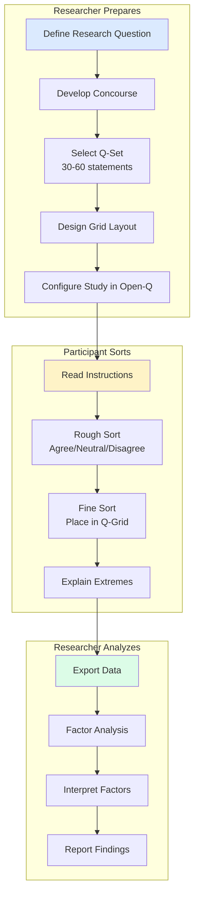

# Q-Methodology: A Researcher's Guide

Q-methodology is a research approach for studying **subjectivity** — how people think about topics from their own perspective. Open-Q provides the digital infrastructure to conduct Q-studies online.

---

## What is Q-Methodology?

Q-methodology was developed by psychologist **William Stephenson** in 1935 as a way to study human subjectivity scientifically. Unlike surveys that count how many people agree with statements, Q-methodology reveals **patterns of viewpoints** across a population.

### Key Concepts

| Term          | Definition                                                                                            |
| ------------- | ----------------------------------------------------------------------------------------------------- |
| **Q-Sort**    | The process of ranking statements along a continuum from "Most Unlike My View" to "Most Like My View" |
| **Concourse** | The full set of possible statements about a topic                                                     |
| **Q-Set**     | A representative subset of statements used in the study (typically 30-60)                             |
| **P-Set**     | The group of participants who complete the Q-sort                                                     |
| **Factor**    | A distinct pattern of viewpoints shared by multiple participants                                      |

---

## How Q-Methodology Works



---

## The Q-Grid

The **Q-grid** is a forced quasi-normal distribution where participants place statements. The most common grid shapes are:

### Standard Distribution (11-point scale, 36 statements)

```
     -5  -4  -3  -2  -1   0  +1  +2  +3  +4  +5
     ┌───┬───┬───┬───┬───┬───┬───┬───┬───┬───┬───┐
     │   │   │   │   │   │   │   │   │   │   │   │
     │   │   │   │   ├───┼───┼───┤   │   │   │   │
     │   │   ├───┼───┼───┼───┼───┼───┼───┤   │   │
     │   ├───┼───┼───┼───┼───┼───┼───┼───┼───┤   │
     └───┴───┴───┴───┴───┴───┴───┴───┴───┴───┴───┘
      2   3   4   5   6   7   6   5   4   3   2  = 47 places
```

### Compact Distribution (7-point scale, 20 statements)

```
         -3  -2  -1   0  +1  +2  +3
         ┌───┬───┬───┬───┬───┬───┬───┐
         │   │   ├───┼───┼───┤   │   │
         │   ├───┼───┼───┼───┼───┤   │
         ├───┼───┼───┼───┼───┼───┼───┤
         └───┴───┴───┴───┴───┴───┴───┘
          2   3   4   5   4   3   2   = 23 places
```

---

## Open-Q Study Phases

Open-Q breaks the Q-sort into manageable phases:

### 1. Pre-Sort (Optional)

Collect demographic or contextual information about participants.

### 2. Rough Sort

Participants quickly categorize all statements into three piles:

- **Agree** — Statements that resonate with their view
- **Neutral** — No strong opinion
- **Disagree** — Statements that don't represent their view

### 3. Fine Sort

Participants place cards from each pile onto the Q-grid pyramid, forcing nuanced distinctions.

### 4. Post-Sort

Participants explain why they placed their most extreme statements (e.g., +5 and -5) where they did.

---

## Configuring Your Study

Open-Q uses JSON configuration to define studies. See the [Configuration Reference](../reference/configuration.md) for details.

### Example Grid Configuration

```json
{
  "grid_config": [
    { "score": -3, "capacity": 2 },
    { "score": -2, "capacity": 3 },
    { "score": -1, "capacity": 4 },
    { "score": 0, "capacity": 5 },
    { "score": 1, "capacity": 4 },
    { "score": 2, "capacity": 3 },
    { "score": 3, "capacity": 2 }
  ]
}
```

---

## Further Reading

- Watts, S., & Stenner, P. (2012). _Doing Q Methodological Research_. SAGE Publications.
- Brown, S. R. (1993). A Primer on Q Methodology. _Operant Subjectivity_, 16(3/4), 91-138.
- [Q Methodology Network](https://qmethod.org/)

---

## Next Steps

- [Creating Studies](../guides/conducting-studies.md)
- [Study Configuration](../reference/configuration.md)
- [Exporting Data](../guides/data-export.md)
