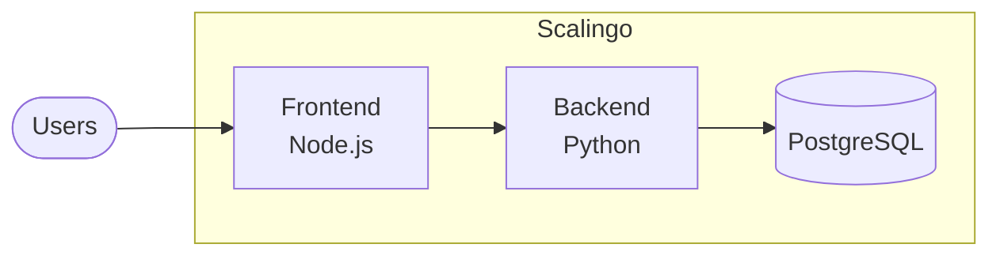

# Deployment Guide

This guide covers deploying Open-Q to production environments.

---

## Deployment Options

| Platform         | Difficulty | Cost                |
| ---------------- | ---------- | ------------------- |
| **Scalingo**     | Easy       | ~€7/mo              |
| **Render**       | Easy       | Free tier available |
| **Heroku**       | Medium     | ~$7/mo              |
| **Docker + VPS** | Advanced   | Variable            |

---

## Scalingo Deployment

Open-Q is deployed on Scalingo with the following architecture:



### Prerequisites

- Scalingo account
- Scalingo CLI installed

### Steps

1. **Create Apps**

   ```bash
   scalingo create open-q-frontend
   scalingo create open-q-backend
   ```

2. **Add PostgreSQL to Backend**

   ```bash
   scalingo -a open-q-backend addons-add postgresql postgresql-starter-512
   ```

3. **Set Environment Variables**

   ```bash
   # Backend
   scalingo -a open-q-backend env-set DATABASE_URL=$SCALINGO_POSTGRESQL_URL

   # Frontend
   scalingo -a open-q-frontend env-set VITE_API_URL=https://open-q-backend.osc-fr1.scalingo.io
   ```

4. **Deploy**

   ```bash
   # From backend directory
   git subtree push --prefix backend scalingo-backend main

   # From frontend directory (or use buildpack)
   ```

---

## Environment Variables

### Backend

| Variable       | Description                       | Required |
| -------------- | --------------------------------- | -------- |
| `DATABASE_URL` | PostgreSQL connection string      | ✅       |
| `SECRET_KEY`   | Application secret (for sessions) | ✅       |
| `CORS_ORIGINS` | Allowed CORS origins              | ✅       |

### Frontend

| Variable       | Description     | Required |
| -------------- | --------------- | -------- |
| `VITE_API_URL` | Backend API URL | ✅       |

---

## Docker Deployment

### docker-compose.yml

```yaml
version: "3.8"
services:
  frontend:
    build: ./frontend
    ports:
      - "3000:3000"
    environment:
      - VITE_API_URL=http://backend:8000
    depends_on:
      - backend

  backend:
    build: ./backend
    ports:
      - "8000:8000"
    environment:
      - DATABASE_URL=postgresql://user:pass@db:5432/openq
    depends_on:
      - db

  db:
    image: postgres:15
    environment:
      - POSTGRES_USER=user
      - POSTGRES_PASSWORD=pass
      - POSTGRES_DB=openq
    volumes:
      - pgdata:/var/lib/postgresql/data

volumes:
  pgdata:
```

### Build & Run

```bash
docker-compose up --build
```

---

## Database Migrations

```bash
# Initialize database
python init_db.py

# Seed with example study
python seed.py studies/example-study.json
```

---

## Health Checks

| Endpoint          | Purpose         |
| ----------------- | --------------- |
| `GET /`           | Frontend health |
| `GET /api/health` | Backend health  |

---

## SSL/HTTPS

Scalingo and Render provide automatic SSL. For custom deployments, use Let's Encrypt with Certbot.
