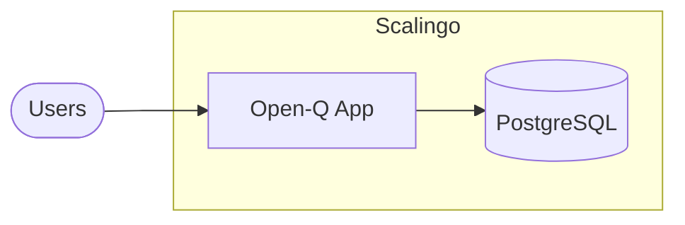

# Deployment Guide

This guide covers deploying Open-Q to production environments.

---

## Deployment Options

| Platform         | Difficulty | Cost                |
| ---------------- | ---------- | ------------------- |
| **Scalingo**     | Easy       | ~€7/mo              |
| **Render**       | Easy       | Free tier available |
| **Heroku**       | Medium     | ~$7/mo              |
| **Docker + VPS** | Advanced   | Variable            |

---

## Scalingo Deployment (Unified)

Open-Q is deployed as a single application where the FastAPI backend serves the pre-built React frontend.



### Prerequisites

- Scalingo account and [Scalingo CLI](https://doc.scalingo.com/cli)
- Application repository pushed to GitHub/GitLab

### Steps

1. **Create the App**

   ```bash
   scalingo create open-q
   ```

2. **Add PostgreSQL Resource**

   ```bash
   scalingo --app open-q addons-add postgresql postgresql-starter-512
   ```

3. **Set Environment Variables**

   ```bash
   scalingo --app open-q env-set DATABASE_URL=$SCALINGO_POSTGRESQL_URL
   scalingo --app open-q env-set SECRET_KEY=$(openssl rand -hex 32)
   scalingo --app open-q env-set ALLOWED_ORIGINS=https://open-q.osc-fr1.scalingo.io
   ```

4. **Deploy**
   Push your code to the Scalingo remote. The buildpack will automatically detect the Python environment.
   ```bash
   git push scalingo main
   ```

### 🛰️ Post-Deployment Automation

Open-Q uses a `scalingo.json` configuration to automate critical tasks after every successful build:

- **Schema Verification**: Automatically adds missing columns (like `show_statement_codes`) to your production database without data loss.
- **Study Sync**: Updates your study configuration and statements based on `backend/data/example-study.json`.

You can monitor these tasks in the deployment logs:

```bash
scalingo --app open-q logs --n 100 --source build
```

---

## Environment Variables

| Variable          | Description                                  | Required |
| ----------------- | -------------------------------------------- | -------- |
| `DATABASE_URL`    | Connection string (PostgreSQL or SQLite)     | ✅       |
| `SECRET_KEY`      | Application secret for session security      | ✅       |
| `ALLOWED_ORIGINS` | Comma-separated list of allowed CORS origins | ✅       |

---

## Manual Database Maintenance

If you need to trigger tasks manually without a full redeploy:

```bash
# Force a schema check
scalingo --app open-q run -- python backend/scripts/ensure_schema.py

# Force a study configuration update
scalingo --app open-q run -- python backend/seed.py backend/data/example-study.json
```

---

## Database Reinitialization

> [!CAUTION]
> This will **permanently delete all data** in your production database.

If you need to perform a full "factory reset" of the database (e.g., during initial setup or prototyping):

1. **Reset Infrastructure**
   Wipe all tables and recreate the schema with default admin account:

   ```bash
   scalingo --app open-q run -- python backend/init_db.py --reset
   ```

2. **Repopulate Content**
   Seed the default study data:
   ```bash
   scalingo --app open-q run -- python backend/seed.py backend/data/example-study.json
   ```

---

## Health Checks

| Endpoint      | Purpose                                |
| ------------- | -------------------------------------- |
| `GET /`       | Verifies Frontend is correctly served  |
| `GET /health` | Backend API health and DB connectivity |

---

## SSL/HTTPS

Scalingo provides automatic SSL certificates for all applications. No manual configuration is required.
