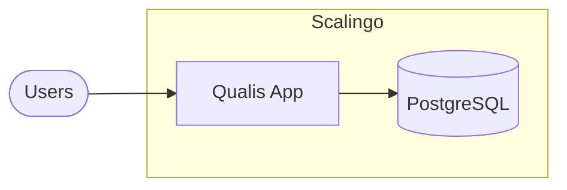

# Deployment

How to deploy Qualis to production. The application ships as a single FastAPI service that also serves the built React frontend, plus a Postgres database. Audio, when used, lives in S3-compatible object storage.

For the canonical list of environment variables (with types and defaults), see [`../reference/configuration.md#environment--app-settings`](../reference/configuration.md#environment--app-settings). This guide covers how to wire them on each supported platform.

---

## Supported platforms

Two paths are documented, and both are exercised:

| Platform | Status |
| -------- | ------ |
| **Scalingo** | Documented [below](#scalingo). The instance the maintainer runs in production. |
| **Docker (self-host)** | Documented [below](#docker). `docker-compose.production.yml` in the repo root, and the stack CI builds and health-checks on every pull request. |

Qualis is an ordinary Python app with a `Procfile`, so any platform that speaks
the standard Python buildpack — Heroku, Render, Clever Cloud — should run it with
the same environment variables. Those are **not** tested and not documented
step-by-step here, so treat them as plausible rather than supported: earlier
versions of this page rated their difficulty, which implied a verification that
had never happened.

---

## Scalingo

Qualis is deployed as a single application; the FastAPI backend serves the pre-built React frontend.


```mermaid
graph LR
    subgraph Scalingo
        App[Qualis App]
        DB[(PostgreSQL)]
    end

    User([Users]) --> App
    App --> DB
```

### Prerequisites

- A Scalingo account and the [Scalingo CLI](https://doc.scalingo.com/cli).
- The repository pushed to GitHub or GitLab.

`scalingo.json` in the repo root declares the addon and every variable the app
needs, generating `SECRET_KEY`, `IP_HASH_SALT` and `ADMIN_PASSWORD` rather than
letting them fall back to defaults. A one-click deploy from that manifest asks
only for `ADMIN_EMAIL`, `FRONTEND_URL` and `ALLOWED_ORIGINS`; the generated
password is readable from the app's environment variables in the dashboard, and
should be changed after the first login.

The steps below do the same thing from the CLI, which is what you want when
deploying into an existing app or an organisation account.

### Steps

1. **Create the app**

   ```bash
   scalingo create qualis
   ```

2. **Add PostgreSQL**

   ```bash
   scalingo --app qualis addons-add postgresql postgresql-starter-512
   ```

3. **Set environment variables**

   Choose the email for the first owner account and generate a password. Save
   the printed password in your password manager before continuing: it is the
   credential you will use for the first login.

   ```bash
   QUALIS_ADMIN_EMAIL="you@institution.example" # replace with your email
   QUALIS_ADMIN_PASSWORD="$(openssl rand -base64 24)"
   printf 'Initial Qualis password: %s\n' "$QUALIS_ADMIN_PASSWORD"

   scalingo --app qualis env-set SECRET_KEY=$(openssl rand -hex 32)
   scalingo --app qualis env-set IP_HASH_SALT=$(openssl rand -hex 32)
   scalingo --app qualis env-set "ADMIN_EMAIL=$QUALIS_ADMIN_EMAIL"
   scalingo --app qualis env-set "ADMIN_PASSWORD=$QUALIS_ADMIN_PASSWORD"
   scalingo --app qualis env-set FRONTEND_URL=https://qualis.osc-fr1.scalingo.io
   scalingo --app qualis env-set ALLOWED_ORIGINS=https://qualis.osc-fr1.scalingo.io
   scalingo --app qualis env-set TRUSTED_PROXIES=\*
   scalingo --app qualis env-set ENVIRONMENT=production
   ```

   The PostgreSQL addon already creates `DATABASE_URL` as an alias of
   `SCALINGO_POSTGRESQL_URL`; do not copy the connection string into another
   variable. Keeping the alias lets Scalingo rotate the database URL safely.

4. **Deploy**

   ```bash
   git push scalingo main
   ```

The Python buildpack picks up `pyproject.toml` and `package.json` automatically.

### Post-deploy automation

`Procfile` runs the following on every successful build:

- `alembic upgrade head` — applies pending migrations.
- An admin bootstrap step that creates the initial admin account (using `ADMIN_EMAIL` / `ADMIN_PASSWORD`) if the database is empty.

The bootstrap fails closed on an empty production database when either admin
variable is missing or uses a documented demo value. Existing databases, where
an account already exists, are unaffected.

Watch the logs:

```bash
scalingo --app qualis logs -n 100
```

---

## Docker

The root `docker-compose.yml` is deliberately a **local demo**: it contains
public credentials and development secrets. Use it only through `make demo-up`.
Do not expose that stack to a network or adapt it for production.

For a self-hosted production deployment, use the separate, fail-closed Compose
file. It binds Qualis to the host loopback interface so that a TLS reverse proxy
can be the only public entry point.

### Prerequisites

- A Linux server with Git, Docker, and the `docker compose` plugin.
- A public domain pointing to the server.
- A TLS reverse proxy such as Caddy, Traefik, or nginx.

### Steps

1. **Create the private environment file**

   ```bash
   cp .env.production.example .env.production
   openssl rand -hex 32 # QUALIS_DB_PASSWORD
   openssl rand -hex 32 # SECRET_KEY
   openssl rand -hex 32 # IP_HASH_SALT
   openssl rand -base64 24 # ADMIN_PASSWORD
   ```

   Edit `.env.production`: paste each generated value, choose `ADMIN_EMAIL`,
   and replace `qualis.example.org` in `FRONTEND_URL`, `ALLOWED_ORIGINS`, and
   `QUALIS_ALLOWED_HOST_PATTERN`. Use `[.]` for literal dots in the host regex.
   The generated hexadecimal database password is URL-safe.

2. **Validate before starting anything**

   ```bash
   docker compose --env-file .env.production \
     -f docker-compose.production.yml config --quiet
   ```

   This fails when a required value is empty. It must finish without output.

3. **Build and start the stack**

   ```bash
   docker compose --env-file .env.production \
     -f docker-compose.production.yml up --build -d
   docker compose --env-file .env.production \
     -f docker-compose.production.yml ps
   ```

   Configure the reverse proxy to forward the public HTTPS domain to
   `http://127.0.0.1:3000` (or the `QUALIS_HTTP_PORT` you chose). For example,
   a minimal Caddyfile is:

   ```caddyfile
   qualis.example.org {
       reverse_proxy 127.0.0.1:3000
   }
   ```

   Replace the domain and restart Caddy; it obtains the TLS certificate
   automatically. Then sign in with `ADMIN_EMAIL` and `ADMIN_PASSWORD`.

4. **Stop without deleting data**

   ```bash
   docker compose --env-file .env.production \
     -f docker-compose.production.yml down
   ```

   Do not add `--volumes`: the `qualis-pgdata` volume contains the database.
   Back up that volume or PostgreSQL on a schedule before collecting real data.

This baseline does not enable audio uploads, SMTP, or Redis. Add their variables
from the [Configuration reference](../reference/configuration.md#environment--app-settings)
when needed; audio also requires S3-compatible object storage.

---

## Configuration checklist

Before deploying, complete the environment-specific values in the
[Configuration reference](../reference/configuration.md#environment--app-settings).
The production Compose path additionally validates every required value in
`.env.production` before it starts containers.

---

## Audio storage (object storage)

Audio is optional. Spoken feedback and `text_audio` questions need
S3-compatible object storage; everything else — presort, sorting, postsort
text, exports, analysis — runs without it. When the `S3_*` variables are
unset, Qualis starts in **storage-optional mode**: audio-enabled studies
degrade silently to text-only, with no error shown to participants (see
[`running-without-s3.md`](running-without-s3.md) for the capability matrix).

The production Compose file deliberately does **not** bundle a storage server,
unlike the dev stack — which ships MinIO purely so `make demo-up` works with
zero setup. Choose per deployment:

| Situation | Recommendation |
| --------- | -------------- |
| **No audio** | Leave the `S3_*` variables unset. Storage-optional mode handles it; nothing to run or back up. |
| **Audio, least operations** | A **managed** S3-compatible service — Cloudflare R2, Backblaze B2, AWS S3, or the object-storage add-on of your platform (Scalingo, Clever Cloud). Durable and backed up by the provider; R2/B2 have no egress fees. |
| **Audio + data sovereignty / air-gapped / you already run object storage** | **Self-hosted MinIO**, accepting the operational burden below. |

**Why self-hosted MinIO is not the default.** It is viable, but it is a
stateful service you take responsibility for:

- Its data needs its own backup schedule, separate from Postgres. A single
  MinIO node is a single point of failure for every audio recording.
- MinIO ships breaking changes between releases — the reason the dev images
  are pinned to a dated tag rather than `:latest`. Each upgrade is a change to
  review, not a free bump.
- Playback uses presigned URLs handed to the browser, so the store must be
  reachable **from the browser**, not just from the backend. That means a
  public hostname with its own TLS — see `S3_PUBLIC_ENDPOINT_URL` below.

**Configuration.** Whichever backend you pick, set:

```bash
S3_ENDPOINT_URL=https://<storage-host>          # where the backend uploads
S3_PUBLIC_ENDPOINT_URL=https://<browser-host>   # where the browser plays back
                                                # (defaults to S3_ENDPOINT_URL)
S3_BUCKET_NAME=qualis-audio
S3_ACCESS_KEY_ID=                               # credential from your provider
S3_SECRET_ACCESS_KEY=                           # credential from your provider
S3_REGION=us-east-1                             # or the provider's region
S3_ADDRESSING_STYLE=auto                        # 'path' for MinIO, 'virtual' for most managed S3
```

`S3_PUBLIC_ENDPOINT_URL` matters when the store is reached internally at one
host but served to the browser at another (the dev stack uploads to
`http://minio:9000` and plays back from `http://localhost:9000`). For a managed
service the two are usually the same public host, so it can be omitted.

---

## Account onboarding & public registration

Three ways an account comes into being:

1. **First owner** — created from `ADMIN_EMAIL` / `ADMIN_PASSWORD` when the database is empty (see [Post-deploy automation](#post-deploy-automation)).
2. **Invitation** — an Owner or Member invites a colleague from **Team members**; the invitee follows a tokened `/register` link that pre-fills their email and grants project access. This is the intended discoverable onboarding path.
3. **Public self-registration** — `POST /api/register` **without** an invitation token.

Public self-registration is controlled by `ALLOW_PUBLIC_REGISTRATION` (default `true`, so token-less sign-ups are accepted). For an invitation-only instance — the common posture for institutional research deployments — set:

```bash
ALLOW_PUBLIC_REGISTRATION=false
```

Token-less registration then returns `403`; invitations and the `ADMIN_*` bootstrap are unaffected. The setting does not change the shipped UI (which is invitation-driven either way).

---

## Manual database operations

Use `--` to separate Scalingo CLI flags from the command arguments.

### Apply migrations

```bash
scalingo --app qualis run -- python src/backend/scripts/migrate.py
```

### Seed a study

```bash
scalingo --app qualis run -- env API_BASE_URL=http://internal python src/backend/seed.py src/backend/data/example-study.json
```

### Database reinitialisation

> [!CAUTION]
> Permanently deletes all data. Use only during initial setup or in a throwaway prototyping environment, before any real data exists.

```bash
scalingo --app qualis run -- python src/backend/init_db.py --reset
```

To wipe and reseed in one step:

```bash
scalingo --app qualis run -- bash -c "python src/backend/init_db.py --reset && env API_BASE_URL=http://internal python src/backend/seed.py src/backend/data/example-study.json"
```

---

## Verify the deployment

Open `/` to verify the frontend, then request `/health` and confirm it returns
`{"status": "ok"}`. The stable endpoint contract is listed in the
[Operations reference](../reference/operations.md#health-endpoints).

---

## SSL

Scalingo provisions SSL certificates automatically. For Docker / VPS deployments, terminate TLS at a reverse proxy (Caddy, Traefik, nginx) and forward to the app on its internal port; if the proxy adds `X-Forwarded-For`, set `TRUSTED_PROXIES` to the proxy's IP so that rate limiting keys on the real client.

---

## Upgrading PostgreSQL

`docker-compose.production.yml` moved from `postgres:16-alpine` to
`postgres:18-alpine`. **This is not a drop-in swap for an existing deployment.**
Two things change at once:

* PostgreSQL major versions cannot read each other's data directory. An 18
  server refuses to start against a 16 cluster — it fails loudly with
  `database files are incompatible with server`, so nothing is corrupted, but
  the service stays down until the data is migrated.
* The official image relocated `PGDATA` from `/var/lib/postgresql/data` to
  `/var/lib/postgresql/18/docker`, and its `VOLUME` from the former to
  `/var/lib/postgresql`. The compose file's mount point moved to match.

To migrate, dump on 16 and restore on 18. **Take the dump before pulling the new
compose file**, while the 16 image is still what's running:

```bash
# 1. With the OLD (16) compose file still checked out, dump the database
docker compose --env-file .env.production -f docker-compose.production.yml \
  exec -T db pg_dumpall -U qualis > qualis-backup-$(date +%F).sql

# 2. Stop, and remove the old volume once the dump is verified non-empty
docker compose --env-file .env.production -f docker-compose.production.yml down
docker volume rm qualis-production_qualis-pgdata

# 3. Pull the new compose file, start only the database, and restore
docker compose --env-file .env.production -f docker-compose.production.yml up -d db
docker compose --env-file .env.production -f docker-compose.production.yml \
  exec -T db psql -U qualis -d postgres < qualis-backup-$(date +%F).sql

# 4. Bring the rest up; migrations run as usual
docker compose --env-file .env.production -f docker-compose.production.yml up -d
```

Check the dump file is non-empty and ends with a complete statement before
deleting anything. If you would rather not migrate right now, pinning
`image: postgres:16-alpine` and restoring the `/var/lib/postgresql/data` mount
point keeps the previous behaviour — the application code supports both.

## Email transport (auth flows)

Email-driven auth flows degrade gracefully when SMTP is absent. Configure the
SMTP and token-expiry values from the
[Configuration reference](../reference/configuration.md#email-smtp), then use
the procedure below to schedule consumed-token cleanup.

**Cron cleanup (F-03-003):** consumed email tokens (2FA-disable JTIs, sign-up verification JTIs, password-reset JTIs, email-change JTIs) accumulate in the `consumed_email_tokens` table. The script `src/backend/scripts/cleanup_consumed_email_tokens.py` deletes rows older than 7 days and is safe to run while the app is live.

> [!IMPORTANT]
> This cleanup is **operator-side**. The application does not auto-schedule it. On Scalingo, configure the [Scalingo Scheduler addon](https://doc.scalingo.com/platform/app/task-scheduling/scalingo-scheduler) (free) with a daily cron entry. Other platforms: add the equivalent system cron / scheduled-task entry.

### Scalingo cron config

Add the addon and a `cron.json` at the repo root:

```bash
scalingo --app qualis addons-add scheduler scheduler-sandbox
```

`cron.json`:

```json
{
  "jobs": [
    {
      "command": "0 4 * * * cd src/backend && uv --project . run python scripts/cleanup_consumed_email_tokens.py",
      "size": "S"
    }
  ]
}
```

Deploy normally. The job runs daily at 04:00 UTC and prints `deleted=<n>` to the scheduler log.

### Manual one-off run

```bash
scalingo --app qualis run -- bash -c "cd src/backend && uv --project . run python scripts/cleanup_consumed_email_tokens.py"
```

Without the cron, the table will grow proportionally to the rate of consumed email tokens (negligible risk for low-traffic deployments; meaningful storage drift over months at production scale).
