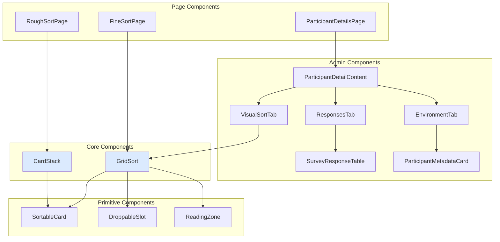

# Frontend Components

This guide documents the key reusable React components in Libre-Q.

---

## Component Architecture



---

## CardStack

**Location:** `src/components/CardStack.tsx`

A swipeable card deck for the Rough Sort phase. Uses Framer Motion for gestures.

### Props

| Prop        | Type                                                    | Description                          |
| ----------- | ------------------------------------------------------- | ------------------------------------ |
| `statement` | `{ id: number; text: string; code?: string }`           | The current statement to display     |
| `onVote`    | `(direction: 'agree' \| 'disagree' \| 'neutral') => void` | Callback when card is swiped      |
| `x`         | `MotionValue<number>`                                   | External motion value for X position |
| `y`         | `MotionValue<number>`                                   | External motion value for Y position |

### Usage

```tsx
<CardStack
  statement={currentStatement}
  onVote={handleVote}
  x={motionX}
  y={motionY}
/>
```

> **Responsiveness:** This component uses container queries (`@container`) to adjust font size dynamically based on its container's width.

---

## GridSort

**Location:** `src/components/GridSort.tsx`

The main Q-grid component with zoom/pan support for Fine Sort.

### Props

| Prop                     | Type                                                             | Description                                                     |
| :----------------------- | :--------------------------------------------------------------- | :-------------------------------------------------------------- |
| `agreeCards`             | `{ id: number; text: string; code?: string }[]`                  | Cards for the "Agree" pile                                      |
| `disagreeCards`          | `{ id: number; text: string; code?: string }[]`                  | Cards for the "Disagree" pile                                   |
| `neutralCards`           | `{ id: number; text: string; code?: string }[]`                  | Cards for the "Neutral" pile                                    |
| `gridColumns`            | `{ score: number; capacity: number }[]`                          | Configuration for the pyramid layout                            |
| `renderSlotContent`      | `(col, row, dimensions) => ReactNode`                            | Render callback for slot content (required)                     |
| `isAllPlaced`            | `boolean`                                                        | Whether all cards have been placed                              |
| `disableHoverZoom`       | `boolean`                                                        | Disables hover magnification (useful for mobile)                |
| `selectedCardId`         | `number \| null`                                                 | Currently selected card                                         |
| `onCardClick`            | `(id: number) => void`                                           | Card selection handler                                          |
| `onSlotClick`            | `(col: number, row: number) => void`                             | Slot click handler                                              |
| `onReset`                | `() => void`                                                     | Reset handler                                                   |
| `onValidate`             | `() => void`                                                     | Validation/submit handler                                       |
| `onDimensionsChange`     | `(d: { width: number; height: number }) => void`                 | Callback when grid dimensions change                            |
| `onZoomChange`           | `(zoom: number) => void`                                         | Callback when zoom level changes                                |
| `onInteractionUtils`     | `(utils: InteractionUtils) => void`                              | Exposes internal interaction utilities                           |
| `showCodes`              | `boolean`                                                        | Show statement codes on cards                                   |
| `highlightKey`           | `string \| null`                                                 | Highlight key for distinguishing statements                     |
| `conditionOfInstruction` | `string \| null`                                                 | Condition of instruction text displayed above grid              |
| `uiLabels`               | `Record<string, string>`                                         | Custom UI label overrides                                       |
| `readOnly`               | `boolean`                                                        | Disable all interaction (used in admin view)                    |
| `sidebarContent`         | `ReactNode`                                                      | Custom content for sidebar area                                 |

### Features

- **Zoom/Pan:** Built-in zoom controls with `react-zoom-pan-pinch`
- **Tips:** Instructional tips that dismiss automatically
- **Piles:** Tabbed deck showing cards by category
- **Mobile:** Tap-to-place interaction mode

---

## SortableCard

**Location:** `src/components/SortableCard.tsx`

A draggable card component using dnd-kit.

### Props

| Prop               | Type                             | Description                              |
| ------------------ | -------------------------------- | ---------------------------------------- |
| `id`               | `number`                         | Unique card ID                           |
| `text`             | `string`                         | Card content (supports Markdown)         |
| `code`             | `string`                         | Statement code (e.g., "S1")              |
| `variant`          | `'hand' \| 'grid' \| 'compact'`  | Visual style                             |
| `isSelected`       | `boolean`                        | Selection state                          |
| `isOverlay`        | `boolean`                        | Render as drag overlay                   |
| `onClick`          | `() => void`                     | Click handler                            |
| `onAction`         | `(id: number) => void`           | Action callback (e.g., zoom)             |
| `dimensions`       | `{ width: number; height: number }` | Explicit card dimensions             |
| `aspectRatio`      | `number \| 'auto'`               | Card aspect ratio                        |
| `disableHoverZoom` | `boolean`                        | Disable hover magnification              |
| `allowScroll`      | `boolean`                        | Allow scroll on long card text           |
| `hasComment`       | `boolean`                        | Show comment indicator icon              |
| `hasAudio`         | `boolean`                        | Show audio indicator icon                |
| `readOnly`         | `boolean`                        | Disable interaction (admin view)         |

### Variants

| Variant   | Use Case               |
| --------- | ---------------------- |
| `hand`    | Cards in deck/pile     |
| `grid`    | Cards placed in Q-grid |
| `compact` | Small preview cards    |

---

## DroppableSlot

**Location:** `src/components/DroppableSlot.tsx`

A drop zone for placing cards in the Q-grid.

### Props

| Prop       | Type         | Description                              |
| ---------- | ------------ | ---------------------------------------- |
| `id`       | `string`     | Slot identifier (format: `col-row`)      |
| `children` | `ReactNode`  | Slot contents                            |
| `isOver`   | `boolean`    | Whether a card is being dragged over     |
| `role`     | `string`     | ARIA role: `'button'` (default) or `'gridcell'` |
| `onClick`  | `() => void` | Click handler for tap-to-place           |

Extends `React.HTMLAttributes<HTMLDivElement>` for full customization.

---

## ReadingZone

**Location:** `src/components/ReadingZone.tsx`

Displays a zoomed/magnified view of the currently hovered or active card within the GridSort component.

---

## Admin Components

### ParticipantDetailContent

**Location:** `src/components/admin/dashboard/ParticipantDetailContent.tsx`

The primary container for inspecting a participant session. Organizes content into three tabs: **Visual Sort**, **Responses**, and **Environment**.

### SurveyResponseTable

**Location:** `src/components/admin/dashboard/SurveyResponseTable.tsx`

A dynamic table that displays Pre-sort and Post-sort data. It handles heterogeneous key-value pairs and applies automatic label mapping via i18n keys if available.

### ParticipantMetadataCard

**Location:** `src/components/admin/dashboard/ParticipantMetadataCard.tsx`

Displays technical session details including OS, Browser (v), IP, and duration. It uses `ua-parser-js` (via backend) to provide human-readable device information.

### InteractiveDataView

**Location:** `src/components/admin/dashboard/InteractiveDataView.tsx`

The main data visualization interface for study results. Contains a participant table, timeline chart, and device breakdown chart. Includes a `charts/` subdirectory with individual visualization components.

### Analysis Components

**Location:** `src/components/admin/analysis/`

Components for the built-in factor analysis workflow:

| Component                      | Description                                                           |
| :----------------------------- | :-------------------------------------------------------------------- |
| `ScreePlot.tsx`                | Displays eigenvalues with a Kaiser criterion reference line            |
| `FactorLoadingsTable.tsx`      | Participant-by-factor loading matrix with significance highlighting   |
| `FactorArraysView.tsx`        | Composite Q-sort visualization for each factor                       |
| `StatementsTable.tsx`          | Z-scores, factor array positions, and distinguishing/consensus flags |
| `FactorCharacteristicsTable.tsx` | Eigenvalues, variance explained, reliability, and correlations      |

---

## Hooks

### useGridZoom

Manages zoom/pan state and zonal focus for GridSort.

```typescript
const { transformRef, performAutoFit, zoomIn, zoomOut } = useGridZoom({
  wrapperRef,
  contentRef,
  pyramidRef,
  gridColumns,
  activePile,
});
```

### useFineSortDrag

Handles drag-and-drop logic for Fine Sort including edge panning.

```typescript
const {
  sensors,
  handleDragStart,
  handleDragEnd,
  handleCardClick,
  handleSlotClick,
} = useFineSortDrag({
  allCards,
  placements,
  selectedCardId,
  onPlaceCard,
  onMoveCard,
  onSwapCards,
});
```

### useViewport

Provides centralized viewport dimensions and semantic breakpoints.

```typescript
const { width, height, isMobile, isDesktop } = useViewport();
```
