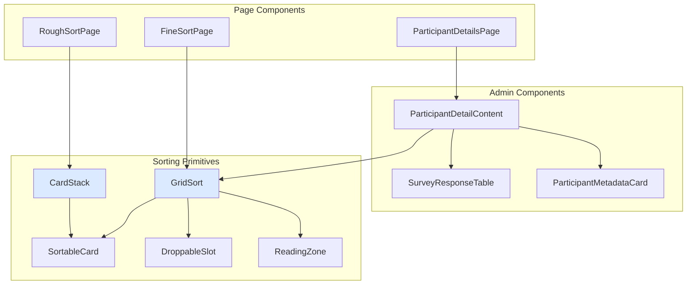

# Frontend Components

Reference for the React component tree under `frontend/src/components/`. Two parts:

1. [Sorting primitives](#sorting-primitives) — full prop tables for the components that drive the participant Q-sort experience (and are reused in admin read-only views).
2. [Component index](#component-index) — every other component, by category, with file path and one-line purpose. Use it to locate the right file before reading source.

For pages (one per route), see `frontend/src/pages/`. For the convention that splits page state/effects into a colocated `useFooPage` hook, see [`../contributing/frontend-guidelines.md`](../contributing/frontend-guidelines.md).

---

## Component architecture



---

## Sorting primitives

### `CardStack`

`src/components/CardStack.tsx`

Swipeable card deck for the rough-sort phase.

| Prop | Type | Description |
| ---- | ---- | ----------- |
| `statement` | `{ id: number; text: string; code?: string }` | Current statement. |
| `onVote` | `(direction: 'agree' \| 'disagree' \| 'neutral') => void` | Swipe / tap callback. |
| `x` | `MotionValue<number>` | External motion value for X position. |
| `y` | `MotionValue<number>` | External motion value for Y position. |

Uses container queries (`@container`) for type sizing.

### `GridSort`

`src/components/GridSort.tsx`

Pyramid Q-sort grid for the fine-sort phase. Used in admin read-only mode for participant inspection.

| Prop | Type | Description |
| ---- | ---- | ----------- |
| `agreeCards` | `Card[]` | Cards in the agree pile. |
| `disagreeCards` | `Card[]` | Cards in the disagree pile. |
| `neutralCards` | `Card[]` | Cards in the neutral pile. |
| `gridColumns` | `{ score: number; capacity: number }[]` | Pyramid column definition. |
| `renderSlotContent` | `(col, row, dimensions) => ReactNode` | Required slot renderer. |
| `isAllPlaced` | `boolean` | Whether every card is placed. |
| `disableHoverZoom` | `boolean` | Disables hover magnification (mobile). |
| `selectedCardId` | `number \| null` | Currently selected card. |
| `onCardClick` | `(id: number) => void` | Card selection handler. |
| `onSlotClick` | `(col: number, row: number) => void` | Slot click handler. |
| `onReset` | `() => void` | Reset handler. |
| `onValidate` | `() => void` | Submit handler. |
| `onDimensionsChange` | `(d: { width: number; height: number }) => void` | Dimension change callback. |
| `onZoomChange` | `(zoom: number) => void` | Zoom level callback. |
| `onInteractionUtils` | `(utils: InteractionUtils) => void` | Exposes internal interaction utilities. |
| `showCodes` | `boolean` | Show statement codes on cards. |
| `highlightKey` | `string \| null` | Highlight key for distinguishing statements. |
| `conditionOfInstruction` | `string \| null` | Condition shown above the grid. |
| `uiLabels` | `Record<string, string>` | UI label overrides. |
| `readOnly` | `boolean` | Disable interaction (admin read-only). |
| `sidebarContent` | `ReactNode` | Custom sidebar content. |

`Card = { id: number; text: string; code?: string }`. Zoom/pan via `react-zoom-pan-pinch`; tap-to-place mode for touch.

### `SortableCard`

`src/components/SortableCard.tsx`

Draggable statement card (dnd-kit).

| Prop | Type | Description |
| ---- | ---- | ----------- |
| `id` | `number` | Card ID. |
| `text` | `string` | Card content (Markdown). |
| `code` | `string` | Statement code. |
| `variant` | `'hand' \| 'grid' \| 'compact'` | Visual style. |
| `isSelected` | `boolean` | Selection state. |
| `isOverlay` | `boolean` | Render as drag overlay. |
| `onClick` | `() => void` | Click handler. |
| `onAction` | `(id: number) => void` | Action callback (e.g. zoom). |
| `dimensions` | `{ width: number; height: number }` | Explicit card size. |
| `aspectRatio` | `number \| 'auto'` | Card aspect ratio. |
| `disableHoverZoom` | `boolean` | Disable hover magnification. |
| `allowScroll` | `boolean` | Allow scroll on long card text. |
| `hasComment` | `boolean` | Show comment indicator. |
| `hasAudio` | `boolean` | Show audio indicator. |
| `readOnly` | `boolean` | Disable interaction (admin read-only). |

| Variant | Use case |
| ------- | -------- |
| `hand` | Cards in a deck/pile. |
| `grid` | Cards placed in the Q-grid. |
| `compact` | Small preview cards. |

### `DroppableSlot`

`src/components/DroppableSlot.tsx`

Drop zone for placing cards in the Q-grid.

| Prop | Type | Description |
| ---- | ---- | ----------- |
| `id` | `string` | Slot identifier (`{col}-{row}`). |
| `children` | `ReactNode` | Slot contents. |
| `isOver` | `boolean` | Whether a card is being dragged over. |
| `role` | `string` | ARIA role: `'button'` (default) or `'gridcell'`. |
| `onClick` | `() => void` | Tap-to-place click handler. |

Extends `React.HTMLAttributes<HTMLDivElement>`.

### `ReadingZone`

`src/components/ReadingZone.tsx`

Fixed zone displaying a magnified view of the currently hovered or active card within `GridSort`. Includes a methodology-tip carousel.

---

## Component index

Sorted alphabetically within each category. Paths are relative to `frontend/src/components/`.

### Layout & error boundaries

| Component | Path | Purpose |
| --- | --- | --- |
| `ErrorBoundary` | `ErrorBoundary.tsx` | App-level React error boundary. |
| `ComponentErrorBoundary` | `ComponentErrorBoundary.tsx` | Granular boundary with inline error display. |
| `RouteErrorBoundary` | `RouteErrorBoundary.tsx` | Catches React Router data-loading errors. |

### Markdown / icons (shared utilities)

| Component | Path | Purpose |
| --- | --- | --- |
| `DynamicIcon` | `DynamicIcon.tsx` | Loads lucide icons by string name. |
| `SafeMarkdown` | `SafeMarkdown.tsx` | XSS-safe Markdown renderer (DOMPurify). |
| `markdown-config` | `markdown-config.tsx` | Markdown rendering configuration object. |

### Participant-facing

| Component | Path | Purpose |
| --- | --- | --- |
| `EraseMyDataDialog` | `EraseMyDataDialog.tsx` | Participant GDPR Art. 17 erasure dialog. |
| `MethodologyTips` | `MethodologyTips.tsx` | Carousel of Q-sort methodology guidance. |
| `SortingAnimation` | `SortingAnimation.tsx` | Demo animation: rough sort then fine sort. |
| `study/HelpOverlay` | `study/HelpOverlay.tsx` | Help dialog contextual to the current step. |
| `study/StudyAccessGate` | `study/StudyAccessGate.tsx` | Password gate for restricted studies. |
| `survey/SurveyField` | `survey/SurveyField.tsx` | Renders a pre-sort survey field. |
| `postsort/Step1_Feedback` | `postsort/Step1_Feedback.tsx` | Post-sort feedback textarea + audio. |
| `postsort/Step2_Questionnaire` | `postsort/Step2_Questionnaire.tsx` | Post-sort survey form. |
| `postsort/ShareStudyLinks` | `postsort/ShareStudyLinks.tsx` | Social sharing buttons after submission. |

### Audio

| Component | Path | Purpose |
| --- | --- | --- |
| `AudioRecorder` | `audio/AudioRecorder.tsx` | Mic recording with playback, upload, deletion. |

### Auth

| Component | Path | Purpose |
| --- | --- | --- |
| `RequireAdmin` | `auth/RequireAdmin.tsx` | Route guard requiring an authenticated admin user. |

### Admin shell

| Component | Path | Purpose |
| --- | --- | --- |
| `AdminDashboard` | `admin/AdminDashboard.tsx` | Top-level admin dashboard layout. |
| `AppSidebar` | `admin/AppSidebar.tsx` | Admin navigation sidebar. |
| `CommandMenu` | `admin/CommandMenu.tsx` | Cmd-K command palette. |
| `DashboardSkeleton` | `admin/DashboardSkeleton.tsx` | Loading skeleton for dashboard content. |
| `GuidanceCard` | `admin/GuidanceCard.tsx` | Collapsible info / tip / warning card. |
| `LegacyRedirect` | `admin/LegacyRedirect.tsx` | Redirects legacy `/admin/*` paths. |
| `ProjectSwitcher` | `admin/ProjectSwitcher.tsx` | Active-project selector. |
| `CreateStudyDialog` | `admin/CreateStudyDialog.tsx` | Dialog to create a study. |
| `ImportStudyDialog` | `admin/ImportStudyDialog.tsx` | Dialog to import a study from JSON. |
| `AudioPlayer` | `admin/AudioPlayer.tsx` | Audio playback for participant responses. |
| `layout/StudyPageHeader` | `admin/layout/StudyPageHeader.tsx` | Study-page header with title, icon, status badge. |

### Admin — dashboard

| Component | Path | Purpose |
| --- | --- | --- |
| `InteractiveDataView` | `admin/dashboard/InteractiveDataView.tsx` | Searchable, paginated participant table. |
| `ParticipantDetailContent` | `admin/dashboard/ParticipantDetailContent.tsx` | Tabbed inspector (Session Metadata / Pre-Sort / Q-Sort Grid / Post-Sort). |
| `ParticipantMetadataCard` | `admin/dashboard/ParticipantMetadataCard.tsx` | Device, browser, IP-hash, durations. |
| `RecentActivityCard` | `admin/dashboard/RecentActivityCard.tsx` | Recent submissions + engagement metrics. |
| `RecruitmentModule` | `admin/dashboard/RecruitmentModule.tsx` | Study link sharing with QR. |
| `StudyStatusControl` | `admin/dashboard/StudyStatusControl.tsx` | Study state transitions (launch / pause / archive). |
| `SurveyResponseTable` | `admin/dashboard/SurveyResponseTable.tsx` | Pre/post-sort answers with i18n label mapping. |
| `charts/DeviceBreakdownChart` | `admin/dashboard/charts/DeviceBreakdownChart.tsx` | Pie chart of desktop/mobile/tablet. |
| `charts/QuestionDistributionCharts` | `admin/dashboard/charts/QuestionDistributionCharts.tsx` | Bar charts for survey distributions. |
| `charts/SubmissionsTimelineChart` | `admin/dashboard/charts/SubmissionsTimelineChart.tsx` | Submissions over time. |

### Admin — analysis

| Component | Path | Purpose |
| --- | --- | --- |
| `AnalysisHistoryPanel` | `admin/analysis/AnalysisHistoryPanel.tsx` | Lists previously persisted analysis runs. |
| `FactorArraysView` | `admin/analysis/FactorArraysView.tsx` | Composite Q-sort visualisation per factor. |
| `FactorCharacteristicsTable` | `admin/analysis/FactorCharacteristicsTable.tsx` | Eigenvalues, variance, reliability, correlations. |
| `FactorLoadingsTable` | `admin/analysis/FactorLoadingsTable.tsx` | Participant-by-factor loadings with flagging controls. |
| `FactorVoicesPanel` | `admin/analysis/FactorVoicesPanel.tsx` | Audio + comments for flagged participants on a factor. |
| `ScreePlot` | `admin/analysis/ScreePlot.tsx` | Eigenvalues + Kaiser reference line. |
| `StatementsTable` | `admin/analysis/StatementsTable.tsx` | Z-scores, factor positions, distinguishing/consensus flags. |

### Admin — designer

| Component | Path | Purpose |
| --- | --- | --- |
| `BrandingEditor` | `admin/designer/BrandingEditor.tsx` | Logo, accent colour, partner logos. |
| `ConditionOfInstructionEditor` | `admin/designer/ConditionOfInstructionEditor.tsx` | Multi-language sorting prompt editor. |
| `IconPicker` | `admin/designer/IconPicker.tsx` | Lucide icon dropdown. |
| `ImageUploadInput` | `admin/designer/ImageUploadInput.tsx` | Image upload with size/format validation. |
| `ImportFromConcourseDialog` | `admin/designer/ImportFromConcourseDialog.tsx` | Pick concourse items to import as statements. |
| `InterfaceEditor` | `admin/designer/InterfaceEditor.tsx` | Interaction mode + interface style. |
| `IntroductionEditor` | `admin/designer/IntroductionEditor.tsx` | Multi-language intro + process steps. |
| `LanguageManagerModal` | `admin/designer/LanguageManagerModal.tsx` | Add/remove study languages. |
| `MarkdownEditor` | `admin/designer/MarkdownEditor.tsx` | Markdown edit + preview with toolbar. |
| `MultiLangFieldIcon` | `admin/designer/MultiLangFieldIcon.tsx` | Translation-status indicator. |
| `PostSortConfigEditor` | `admin/designer/PostSortConfigEditor.tsx` | Post-sort survey + audio configuration. |
| `ProcessStepEditor` | `admin/designer/ProcessStepEditor.tsx` | Reorderable process-step list. |
| `QSortEditor` | `admin/designer/QSortEditor.tsx` | Statements, distribution, defaults. |
| `QuestionBuilder` | `admin/designer/QuestionBuilder.tsx` | Survey question builder with drag-reorderable options. |
| `UnsavedChangesDialog` | `admin/designer/UnsavedChangesDialog.tsx` | Navigation guard for unsaved changes. |

### Admin — concourse

| Component | Path | Purpose |
| --- | --- | --- |
| `ItemDetailSheet` | `admin/concourse/ItemDetailSheet.tsx` | Slide-out sheet: item details, versions, comments. |

### UI primitives (`ui/`)

Shadcn UI wrappers around Radix primitives. Used throughout the app for consistent styling. Source: `frontend/src/components/ui/`.

`accordion`, `alert`, `alert-dialog`, `badge`, `breadcrumb`, `button`, `card`, `checkbox`, `dialog`, `dropdown-menu`, `form`, `input`, `label`, `progress`, `radio-group`, `select`, `separator`, `sheet`, `sidebar`, `skeleton`, `switch`, `table`, `tabs`, `textarea`, `tooltip`.

---

## Hooks

The page-level state-and-effect logic for complex pages is extracted into colocated hooks in `frontend/src/hooks/<area>/use<Name>.ts`. See [`../contributing/frontend-guidelines.md`](../contributing/frontend-guidelines.md) for the boundary rules.

A few component-level hooks are reused:

### `useGridZoom`

Manages zoom/pan state and zonal focus for `GridSort`. Lives at `hooks/useGridZoom.ts` (root of `hooks/`, not an `<area>` subdir).

```typescript
const { transformRef, performAutoFit, zoomIn, zoomOut } = useGridZoom({
  wrapperRef,
  contentRef,
  onZoomChange,
  onTransformChange,
});
```

### `useFineSortDrag`

Drag-and-drop logic for fine sort (including edge panning). Lives at `hooks/useFineSortDrag.ts` (root of `hooks/`, not an `<area>` subdir).

```typescript
const {
  activeId,
  handleDragStart,
  handleDragMove,
  handleDragEnd,
  handleDragCancel,
  findClosestEmptyRow,
  handleCardClick,
  handleSlotClick,
} = useFineSortDrag({
  responses,
  gridColumns,
  actions,
  onSelectionChange,
  selectedId,
  interactionUtils,
  onPan,
  statements,
  distributionMode,
});
```

### `useViewport`

Centralised viewport dimensions and breakpoints.

```typescript
const { width, height, isMobile, isDesktop } = useViewport();
```
