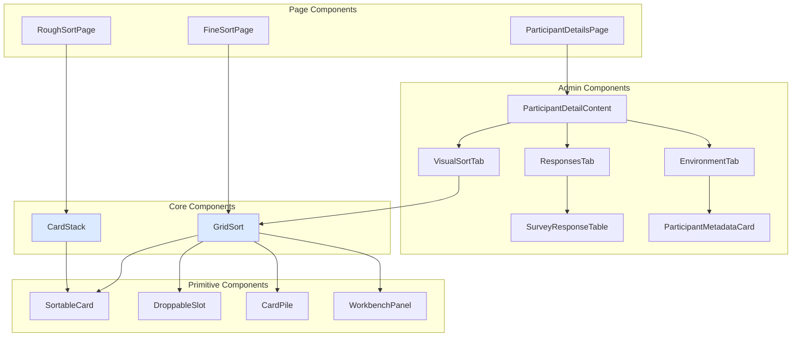

# Frontend Components

This guide documents the key reusable React components in Open-Q.

---

## Component Architecture



---

## CardStack

**Location:** `src/components/CardStack.tsx`

A swipeable card deck for the Rough Sort phase. Uses Framer Motion for gestures.

### Props

| Prop      | Type                                               | Description                          |
| --------- | -------------------------------------------------- | ------------------------------------ |
| `cards`   | `Card[]`                                           | Array of cards to display            |
| `onSwipe` | `(direction: 'left' \| 'right' \| 'down') => void` | Callback when card is swiped         |
| `x`       | `MotionValue<number>`                              | External motion value for X position |
| `y`       | `MotionValue<number>`                              | External motion value for Y position |

### Usage

```tsx
<CardStack
  cards={unsortedCards}
  onSwipe={handleSwipe}
  x={motionX}
  y={motionY}
/>
```

> **Responsiveness:** This component uses container queries (`@container`) to adjust font size dynamically based on its container's width.

---

## GridSort

**Location:** `src/components/GridSort.tsx`

The main Q-grid component with zoom/pan support for Fine Sort.

### Props

| Prop                | Type                                 | Description                      |
| ------------------- | ------------------------------------ | -------------------------------- |
| `agreeCards`        | `Card[]`                             | Cards from "agree" pile          |
| `disagreeCards`     | `Card[]`                             | Cards from "disagree" pile       |
| `neutralCards`      | `Card[]`                             | Cards from "neutral" pile        |
| `gridColumns`       | `GridColumn[]`                       | Grid configuration               |
| `renderSlotContent` | `(col, row) => ReactNode`            | Render function for slot content |
| `forcedTipsClosed`  | `boolean`                            | Hide instructional tips          |
| `selectedCardId`    | `number \| null`                     | Currently selected card          |
| `onCardClick`       | `(id: number) => void`               | Card selection handler           |
| `onSlotClick`       | `(col: number, row: number) => void` | Slot click handler               |

### Features

- **Zoom/Pan:** Built-in zoom controls with `react-zoom-pan-pinch`
- **Tips:** Instructional tips that dismiss automatically
- **Piles:** Tabbed deck showing cards by category
- **Mobile:** Tap-to-place interaction mode

---

## SortableCard

**Location:** `src/components/SortableCard.tsx`

A draggable card component using dnd-kit.

### Props

| Prop         | Type                            | Description                      |
| ------------ | ------------------------------- | -------------------------------- |
| `id`         | `number`                        | Unique card ID                   |
| `text`       | `string`                        | Card content (supports Markdown) |
| `variant`    | `'hand' \| 'grid' \| 'compact'` | Visual style                     |
| `isSelected` | `boolean`                       | Selection state                  |
| `onClick`    | `() => void`                    | Click handler                    |
| `isOverlay`  | `boolean`                       | Render as drag overlay           |

### Variants

| Variant   | Use Case               |
| --------- | ---------------------- |
| `hand`    | Cards in deck/pile     |
| `grid`    | Cards placed in Q-grid |
| `compact` | Small preview cards    |

---

## DroppableSlot

**Location:** `src/components/DroppableSlot.tsx`

A drop zone for placing cards in the Q-grid.

### Props

| Prop       | Type         | Description                              |
| ---------- | ------------ | ---------------------------------------- |
| `id`       | `string`     | Slot identifier (format: `slot_col_row`) |
| `children` | `ReactNode`  | Slot contents                            |
| `onClick`  | `() => void` | Click handler for tap-to-place           |

---

## CardPile

**Location:** `src/components/CardPile.tsx`

Displays a stack of cards in a pile with count badge.

### Props

| Prop      | Type                                 | Description               |
| --------- | ------------------------------------ | ------------------------- |
| `type`    | `'agree' \| 'disagree' \| 'neutral'` | Pile category             |
| `count`   | `number`                             | Number of cards remaining |
| `topCard` | `Card \| undefined`                  | Card to display on top    |

---

## Admin Components

### ParticipantDetailContent

**Location:** `src/components/admin/exports/ParticipantDetailContent.tsx`

The primary container for inspecting a participant session. Organizes content into three tabs: **Visual Sort**, **Responses**, and **Environment**.

### SurveyResponseTable

**Location:** `src/components/admin/exports/SurveyResponseTable.tsx`

A dynamic table that displays Pre-sort and Post-sort data. It handles heterogeneous key-value pairs and applies automatic label mapping via i18n keys if available.

### ParticipantMetadataCard

**Location:** `src/components/admin/exports/ParticipantMetadataCard.tsx`

Displays technical session details including OS, Browser (v), IP, and duration. It uses `ua-parser-js` (via backend) to provide human-readable device information.

---

## Hooks

### useGridZoom

Manages zoom/pan state and zonal focus for GridSort.

```typescript
const { transformRef, performAutoFit, zoomIn, zoomOut } = useGridZoom({
  wrapperRef,
  contentRef,
  pyramidRef,
  gridColumns,
  activePile,
});
```

### useFineSortDrag

Handles drag-and-drop logic for Fine Sort including edge panning.

```typescript
const {
  sensors,
  handleDragStart,
  handleDragEnd,
  handleCardClick,
  handleSlotClick,
} = useFineSortDrag({
  allCards,
  placements,
  selectedCardId,
  onPlaceCard,
  onMoveCard,
  onSwapCards,
});
```

### useViewport

Provides centralized viewport dimensions and semantic breakpoints.

```typescript
const { width, height, isMobile, isDesktop } = useViewport();
```
