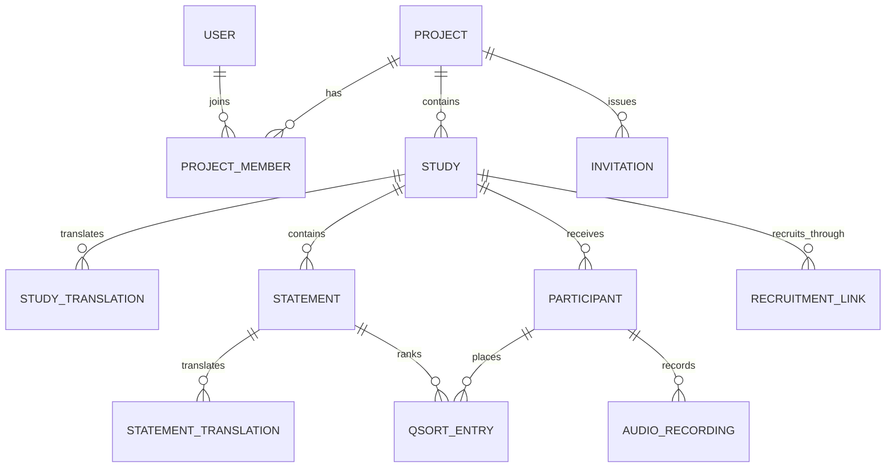

# Data model reference

Qualis stores research work inside projects. This page summarizes the persistent
entities and their relationships; SQLAlchemy models and Alembic migrations remain
the executable source of truth.

## Core relationships

## Entity index

| Entity | Responsibility | Important constraints |
| ------ | -------------- | --------------------- |
| `Project` | Tenant boundary for studies and collaboration | Unique slug |
| `ProjectMember` | User membership and project role | One membership per user/project |
| `User` | Researcher identity and platform privileges | Unique email |
| `Study` | Study configuration and lifecycle | Unique slug; draft/active/paused/closed/archived state |
| `StudyTranslation` | Participant-facing study text by language | One row per study/language |
| `Statement` | Ordered Q-set item | Study-scoped code/order |
| `StatementTranslation` | Statement text by language | One row per statement/language |
| `Participant` | Session, consent, progress, and submitted responses | Unique session token; forward-only progress |
| `QSortEntry` | A participant's score and optional card comment | Participant/statement placement |
| `AudioRecording` | Metadata and object-storage key for recorded answers | Unique object key |
| `RecruitmentLink` | Public, individual, or capacity-limited study access | Unique token |
| `Invitation` | Time-limited project invitation | Unique token |

## Integrity and privacy fields

- `consent_hash` records the consent-text version shown to a participant.
- `ip_address` and `user_agent` store salted hashes, not their raw values.
- `last_step_reached` advances only forward.
- `session_token` seeds deterministic statement randomization.
- participant anonymization clears or rotates identifying session fields while
  preserving the research record according to the documented lifecycle.

## Source locations

- SQLAlchemy models: `backend/app/models/`
- Pydantic request/response schemas: `backend/app/schemas/`
- Alembic migrations: `backend/alembic/versions/`
- Study import/export shape: [Study Configuration Format](study-configuration-format.md)
- Personal-data inventory: [GDPR memo for self-hosters](gdpr-self-hosters.md)
